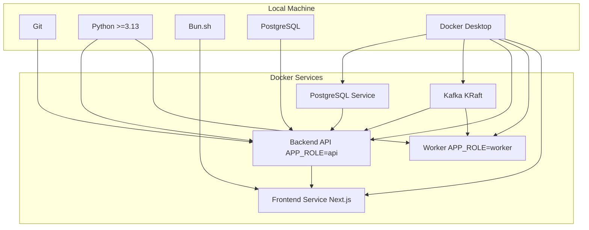
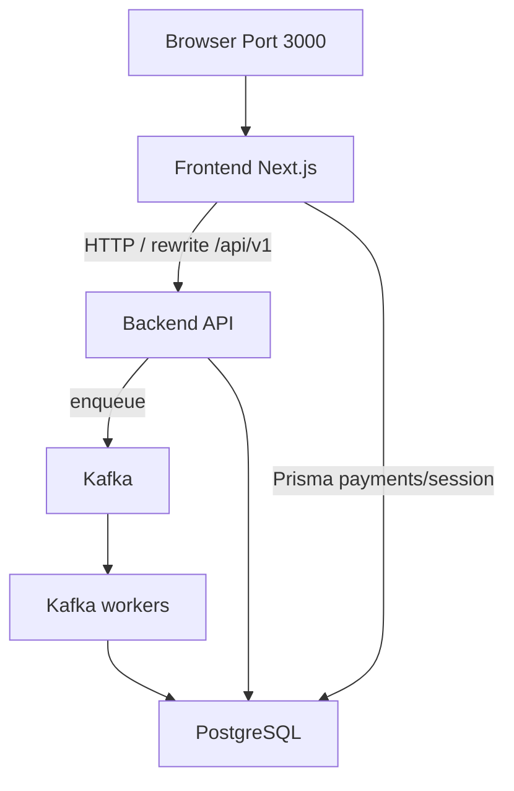
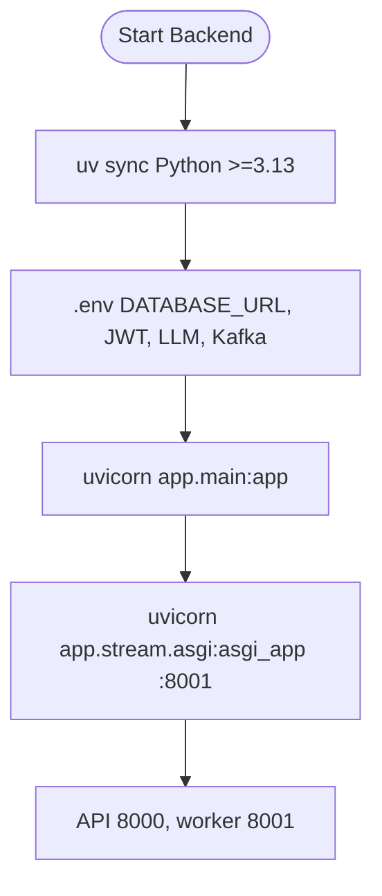
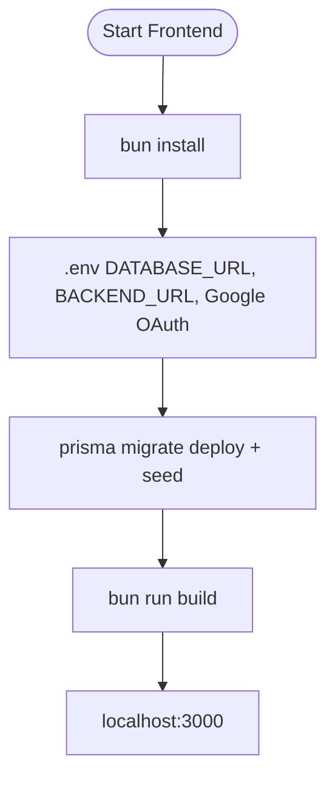
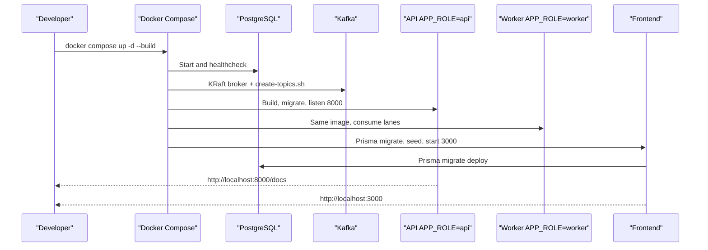
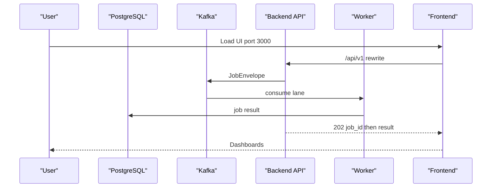
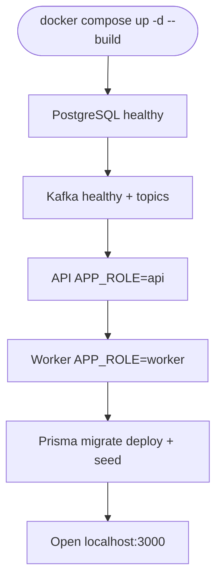
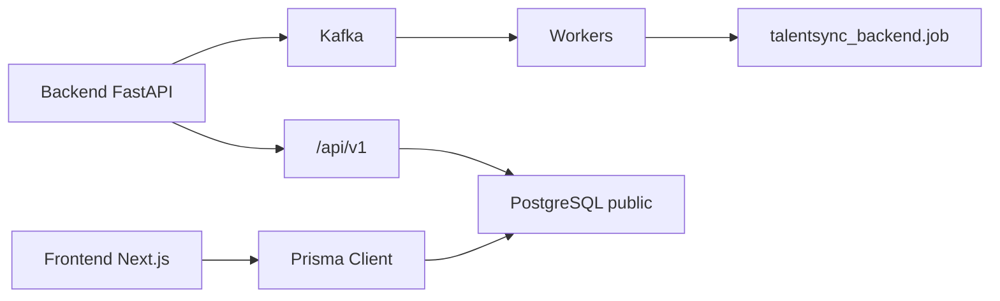

# Getting started

Run the job-seeker TalentSync stack locally: FastAPI backend, Next.js frontend, PostgreSQL, and Kafka for queued AI jobs.

This is [tashifkhan/TalentSync](https://github.com/tashifkhan/TalentSync), the resume builder / ATS optimizer. It is not TalentSync-HR. Recruiter screening dashboards live in that other product.

- Backend: Python >=3.13, FastAPI, LangChain, LangGraph, Motor, PyMuPDF, FastStream Kafka
- Frontend: Next.js 16, React 18.2, Prisma 6, Bun
- Database: PostgreSQL 16
- Jobs: Apache Kafka 3.9.1 (KRaft). AI routes enqueue; workers run the pipelines
- Optional: `admin/` operator console on the `admin` Compose profile

Live app: https://talentsync.tashif.codes/

## Repository layout

- `backend/`: FastAPI, Alembic (`talentsync_backend` schema), FastStream workers
- `frontend/`: Next.js, Prisma (`public` schema), BFF routes under `app/api`
- `admin/`: operator console + `admin/admin_api` (profile `admin`)
- `infra/kafka/`, `infra/postgres/`, `infra/observability/`
- `docker-compose.yaml`: full local stack (db, kafka, api, worker, frontend)
- `frontend/docker-compose.yaml`: Postgres + Kafka on the host; apps run with `uv` / `bun`
- `docker-compose.prod.yaml`: prefixed service names so they do not collide with TalentSync-HR
- `KAFKA_MIGRATION.md`: job lanes, 202 responses, worker roles
- Root `.env` (copy from `.env.example`)


```mermaid
graph TB
subgraph "Local Machine"
A["Git"]
B["Python >=3.13"]
C["Bun.sh"]
D["PostgreSQL"]
E["Docker Desktop"]
end
subgraph "Docker Services"
DB["PostgreSQL Service"]
K["Kafka KRaft"]
BE["Backend API APP_ROLE=api"]
W["Worker APP_ROLE=worker"]
FE["Frontend Service Next.js"]
end
A --> BE
B --> BE
B --> W
C --> FE
D --> BE
E --> DB
E --> K
E --> BE
E --> W
E --> FE
DB --> BE
K --> BE
K --> W
BE --> FE
```

## Building blocks

- Backend (FastAPI)
  - Python >=3.13 (`backend/pyproject.toml`, `backend/Dockerfile`)
  - FastAPI, langchain, langgraph, motor, pymupdf, faststream[kafka]>=0.7.3
  - Routes under `/api/v1` (and leftover `/api/v2` LLM test paths)
  - One image, three roles via `APP_ROLE`: `api`, `worker`, `migrate`
  - API listens on 8000. Worker health on 8001
- Frontend (Next.js)
  - Bun. `prisma generate` on build
  - Prisma talks to PostgreSQL via `DATABASE_URL`
  - Auth is Google OAuth on the FastAPI backend, not NextAuth. Cookies: `ts_access_token`
  - Port 3000
- Kafka
  - Topics `talentsync.jobs.{lane}.v1` created by `infra/kafka/create-topics.sh`
  - Dev UI at http://localhost:8085
  - Host listener `localhost:29092` if the backend runs on the host
- Database
  - PostgreSQL 16. Prisma owns `public`. Alembic owns `talentsync_backend`
- Admin (optional)
  - `docker compose --profile admin up -d`
  - Console 3010, admin API 8010

## How it fits together

Metered AI work is Kafka-only. The BFF gets `202 { job_id }` and waits. Token streaming (`/chat/stream`, interview SSE) stays on the API process. `KAFKA_ENABLED=true` is required or AI routes return 503.


```mermaid
graph TB
Client["Browser Port 3000"]
FE["Frontend Next.js"]
BE["Backend API"]
W["Kafka workers"]
K["Kafka"]
DB["PostgreSQL"]
Client --> FE
FE --> |HTTP / rewrite /api/v1| BE
BE --> |enqueue| K
K --> W
W --> DB
BE --> DB
FE --> |Prisma payments/session| DB
```

## Prerequisites

- Git
- Python >=3.13
- Bun
- Docker Desktop (recommended)
- PostgreSQL if you skip Compose for the database

Clone:

```bash
git clone https://github.com/tashifkhan/TalentSync
cd TalentSync
cp .env.example .env
```

Fill `JWT_SECRET`, `ENCRYPTION_KEY`, `GOOGLE_CLIENT_ID` / `GOOGLE_CLIENT_SECRET`, LLM keys, and Kafka settings. Compose loads the root `.env`. Do not put secrets in the YAML.

## Manual installation (non-Docker)

Infra in Docker, apps on the host:

```bash
cd frontend
docker compose up -d
```

That starts Postgres, Kafka, kafka-ui, Adminer (`localhost:4444`). Then:

### Backend

```bash
cd backend
uv sync
# .env at repo root, or backend/.env
uv run uvicorn app.main:app --reload
# worker (required for AI jobs)
uv run uvicorn app.stream.asgi:asgi_app --reload --port 8001
```

Point the host backend at `KAFKA_BOOTSTRAP_SERVERS=localhost:29092` and `KAFKA_ENABLED=true`.


```mermaid
flowchart TD
StartBE(["Start Backend"]) --> Venv["uv sync Python >=3.13"]
Venv --> EnvBE[".env DATABASE_URL, JWT, LLM, Kafka"]
EnvBE --> RunBE["uvicorn app.main:app"]
RunBE --> RunW["uvicorn app.stream.asgi:asgi_app :8001"]
RunW --> PortBE["API 8000, worker 8001"]
```

### Frontend

```bash
cd frontend
bun install
bunx prisma migrate deploy
bun prisma/seed.ts
bun run build
# or bun run start after a production build
```

Auth is Google OAuth through `/api/v1/auth/oauth/google/callback` (rewritten to the backend). Credentials email/password is gated by `CREDENTIALS_AUTH_ENABLED` and defaults off.


```mermaid
flowchart TD
StartFE(["Start Frontend"]) --> InstallFE["bun install"]
InstallFE --> EnvFE[".env DATABASE_URL, BACKEND_URL, Google OAuth"]
EnvFE --> Migrate["prisma migrate deploy + seed"]
Migrate --> BuildFE["bun run build"]
BuildFE --> PortFE["localhost:3000"]
```

## Docker-based deployment

### Local (`docker-compose.yaml`)

```bash
docker compose up -d --build
```

Published ports: frontend 3000, API 8000, Kafka host 29092, kafka-ui 8085, Postgres 5432.

Inside the network: `db`, `kafka:9092`, `backend:8000`, `worker`. `APP_ROLE=api` runs Alembic on start in this file (`RUN_MIGRATIONS_ON_START=true`). The worker does not. Frontend command: `bunx prisma migrate deploy && bun prisma/seed.ts && bun run start`.

Optional:

```bash
docker compose --profile admin up -d
docker compose --profile observability up -d
```


```mermaid
sequenceDiagram
participant Dev as "Developer"
participant Compose as "Docker Compose"
participant DB as "PostgreSQL"
participant K as "Kafka"
participant BE as "API APP_ROLE=api"
participant W as "Worker APP_ROLE=worker"
participant FE as "Frontend"
Dev->>Compose : docker compose up -d --build
Compose->>DB : Start and healthcheck
Compose->>K : KRaft broker + create-topics.sh
Compose->>BE : Build, migrate, listen 8000
Compose->>W : Same image, consume lanes
Compose->>FE : Prisma migrate, seed, start 3000
FE->>DB : Prisma migrate deploy
BE-->>Dev : http://localhost:8000/docs
FE-->>Dev : http://localhost:3000
```

### Production (`docker-compose.prod.yaml`)

Service names are `talentsync_*` so they never share a network with TalentSync-HR (`talentsync_hr_*`). Kafka has no host listener. `APP_ROLE=migrate` is a one-shot. Workers are sharded by lane. Admin console binds to a Tailscale address, not the public NIC.

## Environment setup (`.env`)

Copy `.env.example`. Values that matter:

- `DATABASE_URL`: PostgreSQL
- `BACKEND_URL`: FastAPI origin the BFF calls (`http://backend:8000` in Compose, `http://localhost:8000` on the host)
- `FRONTEND_URL`, `BACKEND_BASE_URL`: public origin for OAuth redirects
- `GOOGLE_CLIENT_ID`, `GOOGLE_CLIENT_SECRET`, `GOOGLE_REDIRECT_URI`
- `JWT_SECRET` (must match `BACKEND_JWT_SECRET` on the frontend)
- `ENCRYPTION_KEY` for BYOK keys stored on jobs
- `LLM_*` and `SMALL_LLM_*` (small role defaults to `gemini-3.1-flash-lite`)
- `KAFKA_ENABLED`, `KAFKA_BOOTSTRAP_SERVERS`, `KAFKA_TOPIC_PREFIX=talentsync.jobs`
- `ADMIN_API_KEY` if you start the admin profile

`NEXTAUTH_URL` / `NEXTAUTH_SECRET` still appear in `.env.example` as leftovers. Sign-in is Google OAuth on FastAPI. There is no `next-auth` package.

## Running instructions

### Host apps + Compose infra

1. `cd frontend && docker compose up -d`
2. `cd backend && uv run uvicorn app.main:app --reload`
3. Worker: `uv run uvicorn app.stream.asgi:asgi_app --reload --port 8001`
4. `cd frontend && bun install && bun run build` (or your usual frontend start after env is set)
5. Open http://localhost:3000


```mermaid
sequenceDiagram
participant User as "User"
participant DB as "PostgreSQL"
participant K as "Kafka"
participant BE as "Backend API"
participant W as "Worker"
participant FE as "Frontend"
User->>FE : Load UI port 3000
FE->>BE : /api/v1 rewrite
BE->>K : JobEnvelope
K->>W : consume lane
W->>DB : job result
BE-->>FE : 202 job_id then result
FE-->>User : Dashboards
```

### Full Compose

1. Docker Desktop running
2. `docker compose up -d --build`
3. Wait for db health, kafka topics, Prisma migrate, seed
4. http://localhost:3000, API docs http://localhost:8000/docs, kafka-ui http://localhost:8085


```mermaid
flowchart TD
StartDC(["docker compose up -d --build"]) --> DBReady["PostgreSQL healthy"]
DBReady --> KafkaReady["Kafka healthy + topics"]
KafkaReady --> BackendReady["API APP_ROLE=api"]
BackendReady --> WorkerReady["Worker APP_ROLE=worker"]
WorkerReady --> Migrate["Prisma migrate deploy + seed"]
Migrate --> Browse["Open localhost:3000"]
```

## Dependencies

- Backend: Python >=3.13, FastAPI, LangChain/LangGraph, Motor, PyMuPDF, FastStream 0.7, OpenTelemetry
- Frontend: Next.js 16.1.6, Prisma 6.19, Bun, Razorpay, TanStack Query. No NextAuth
- Jobs: Kafka topics per lane (resume, assessment, communication, social, interview, retry, dlq, events)


```mermaid
graph LR
BE["Backend FastAPI"] --> Routes["/api/v1"]
BE --> K["Kafka"]
K --> W["Workers"]
FE["Frontend Next.js"] --> Prisma["Prisma Client"]
Prisma --> DB["PostgreSQL public"]
Routes --> DB
W --> Jobs["talentsync_backend.job"]
```

## Performance

Compose is the predictable path. Bun for frontend installs. Stay on Python 3.13. Kafka `max.poll.interval` is 30 minutes because enrichments are slow. One broker with replication factor 1 is an accepted SPOF; Postgres holds job payloads so the reaper can republish `QUEUED` rows.

## Troubleshooting

- Python version: backend will not install on 3.12. Use 3.13+.
- Kafka off: AI routes 503. Set `KAFKA_ENABLED=true` and start a worker.
- Host backend cannot reach Kafka: use `localhost:29092`, not `kafka:9092`.
- Prisma migrate fails: `DATABASE_URL` host is `db` in Compose and `localhost` on the host.
- Google login loops: `GOOGLE_REDIRECT_URI` must match the Cloud Console URI exactly (`http://localhost:3000/api/v1/auth/oauth/google/callback` locally).
- Port 3000/8000/5432 busy: stop the other process.
- Worker health: `http://127.0.0.1:8001/health` should be 200 or 204.
- Admin profile: set `ADMIN_API_KEY`. Config writes need the `ts_admin` role from `infra/postgres/admin_grants.sql`.

## Appendix

### Verification

- Backend: http://127.0.0.1:8000/docs
- Worker: http://127.0.0.1:8001/health
- Frontend: http://localhost:3000, Google sign-in
- Kafka UI: http://localhost:8085
- Database: Prisma seed created plans/roles; Alembic created `talentsync_backend.job`
