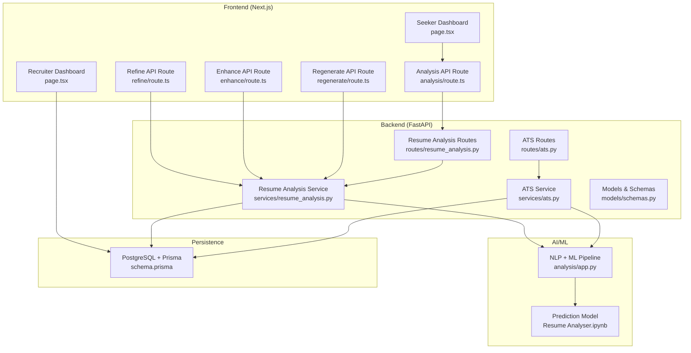
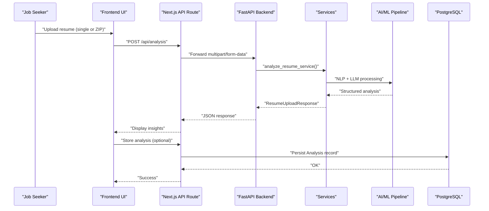
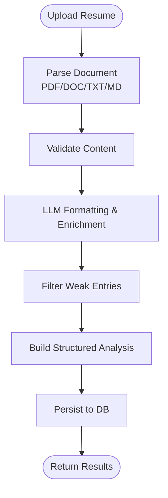
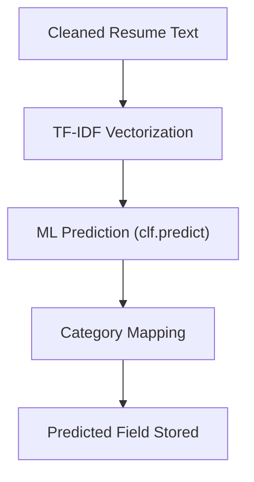
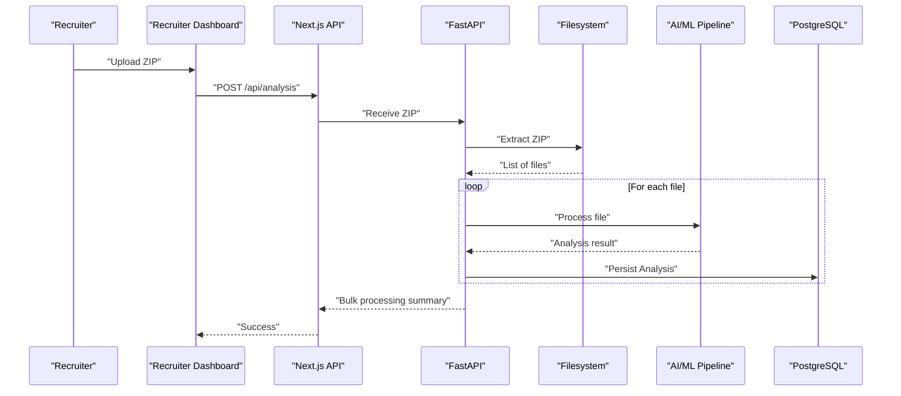
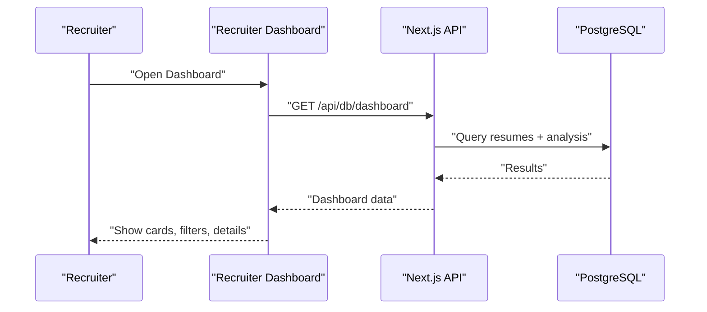
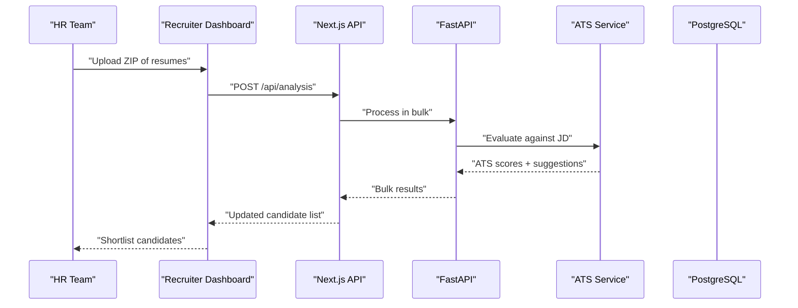
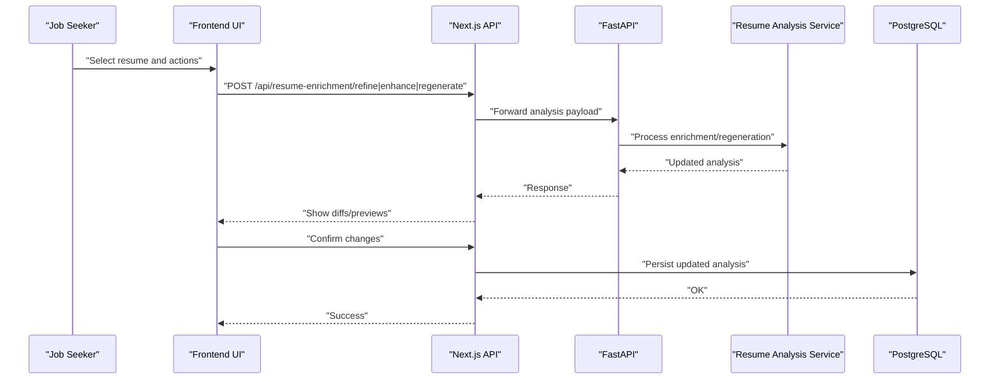
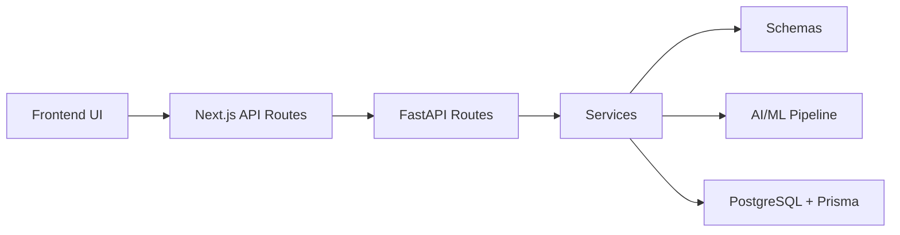

# Key Features Breakdown

<cite>
**Referenced Files in This Document**
- [readme.md](file://readme.md)
- [backend/app/routes/resume_analysis.py](file://backend/app/routes/resume_analysis.py)
- [backend/app/services/resume_analysis.py](file://backend/app/services/resume_analysis.py)
- [backend/app/routes/ats.py](file://backend/app/routes/ats.py)
- [backend/app/services/ats.py](file://backend/app/services/ats.py)
- [backend/app/models/schemas.py](file://backend/app/models/schemas.py)
- [frontend/app/api/(backend-interface)/analysis/route.ts](file://frontend/app/api/(backend-interface)/analysis/route.ts)
- [frontend/app/api/(backend-interface)/resume-enrichment/refine/route.ts](file://frontend/app/api/(backend-interface)/resume-enrichment/refine/route.ts)
- [frontend/app/api/(backend-interface)/resume-enrichment/enhance/route.ts](file://frontend/app/api/(backend-interface)/resume-enrichment/enhance/route.ts)
- [frontend/app/api/(backend-interface)/resume-enrichment/regenerate/route.ts](file://frontend/app/api/(backend-interface)/resume-enrichment/regenerate/route.ts)
- [frontend/app/dashboard/recruiter/page.tsx](file://frontend/app/dashboard/recruiter/page.tsx)
- [frontend/app/dashboard/seeker/page.tsx](file://frontend/app/dashboard/seeker/page.tsx)
- [frontend/app/api/(db)/dashboard/route.ts](file://frontend/app/api/(db)/dashboard/route.ts)
- [frontend/types/dashboard.ts](file://frontend/types/dashboard.ts)
- [frontend/components/about/workflow-interactive.tsx](file://frontend/components/about/workflow-interactive.tsx)
- [frontend/prisma/schema.prisma](file://frontend/prisma/schema.prisma)
- [analysis/app.py](file://analysis/app.py)
- [backend/server.py](file://backend/server.py)
- [analysis/Resume Analyser.ipynb](file://analysis/Resume Analyser.ipynb)
</cite>

## Table of Contents
1. [Introduction](#introduction)
2. [Project Structure](#project-structure)
3. [Core Components](#core-components)
4. [Architecture Overview](#architecture-overview)
5. [Detailed Component Analysis](#detailed-component-analysis)
6. [Dependency Analysis](#dependency-analysis)
7. [Performance Considerations](#performance-considerations)
8. [Troubleshooting Guide](#troubleshooting-guide)
9. [Conclusion](#conclusion)

## Introduction
This document presents the key features of the TalentSync-Normies dual-sided platform, focusing on how job seekers and employers benefit from AI-powered capabilities. It explains the technical implementation behind:
- AI-powered resume analysis for job seekers
- Career path prediction
- Multi-format and bulk upload
- Unlimited free access
- Intuitive talent dashboard for employers
- Efficient bulk processing
- Reduced time-to-hire

The goal is to help stakeholders understand the value delivered by each feature and how they work together to solve real-world hiring and job-search challenges.

## Project Structure
The platform is a modern full-stack system:
- Frontend built with Next.js and TypeScript, providing dashboards and user-facing tools
- Backend built with FastAPI (Python) handling business logic, AI/ML orchestration, and integrations
- AI/ML pipeline leveraging NLP and ML models for resume parsing, enrichment, and prediction
- PostgreSQL-backed persistence with Prisma ORM
- Containerized deployment for scalability

**Diagram sources**
- [frontend/app/dashboard/seeker/page.tsx](file://frontend/app/dashboard/seeker/page.tsx#L1-L197)
- [frontend/app/dashboard/recruiter/page.tsx](file://frontend/app/dashboard/recruiter/page.tsx#L1-L652)
- [frontend/app/api/(backend-interface)/analysis/route.ts](file://frontend/app/api/(backend-interface)/analysis/route.ts#L1-L32)
- [frontend/app/api/(backend-interface)/resume-enrichment/refine/route.ts](file://frontend/app/api/(backend-interface)/resume-enrichment/refine/route.ts#L78-L102)
- [frontend/app/api/(backend-interface)/resume-enrichment/enhance/route.ts](file://frontend/app/api/(backend-interface)/resume-enrichment/enhance/route.ts#L78-L102)
- [frontend/app/api/(backend-interface)/resume-enrichment/regenerate/route.ts](file://frontend/app/api/(backend-interface)/resume-enrichment/regenerate/route.ts#L94-L120)
- [backend/app/routes/resume_analysis.py](file://backend/app/routes/resume_analysis.py#L1-L68)
- [backend/app/services/resume_analysis.py](file://backend/app/services/resume_analysis.py#L1-L364)
- [backend/app/routes/ats.py](file://backend/app/routes/ats.py#L1-L184)
- [backend/app/services/ats.py](file://backend/app/services/ats.py#L1-L214)
- [backend/app/models/schemas.py](file://backend/app/models/schemas.py#L1-L191)
- [analysis/app.py](file://analysis/app.py#L266-L286)
- [analysis/Resume Analyser.ipynb](file://analysis/Resume Analyser.ipynb#L911-L961)
- [frontend/prisma/schema.prisma](file://frontend/prisma/schema.prisma#L100-L137)

**Section sources**
- [readme.md](file://readme.md#L52-L71)

## Core Components
This section outlines the platform’s key capabilities and how they are implemented.

- AI-powered resume analysis for job seekers
  - Parses multi-format resumes (PDF, DOC/DOCX, TXT, MD)
  - Extracts and normalizes structured data (personal info, skills, experience, education, projects)
  - Applies LLM-based formatting and enrichment for ATS-friendly output
  - Returns comprehensive analysis and actionable insights
  - Implemented via FastAPI routes and services, with frontend API wrappers

- Career path prediction
  - Uses trained ML models to predict suitable job fields based on resume content
  - Integrated into the analysis pipeline and surfaced in dashboards
  - Supports both single-file and batch processing

- Multi-format and bulk upload
  - Accepts single or ZIP archives containing multiple resumes
  - Backend extracts and processes files programmatically
  - Enables efficient ingestion for both job seekers and recruiters

- Unlimited free access
  - Core analysis features are free and unlimited to democratize access
  - Encourages broad participation and continuous improvement of the platform

- Intuitive talent dashboard for employers
  - Centralized view of analyzed candidates with filtering and search
  - Highlights predicted fields, skills, and recommended roles
  - Provides quick access to detailed profiles

- Efficient bulk processing
  - Upload hundreds of resumes at once via ZIP
  - Automated parsing, validation, and enrichment
  - Reduces manual effort and speeds up candidate shortlisting

- Reduced time-to-hire
  - Pre-ranked and enriched candidate profiles accelerate decision-making
  - ATS alignment and targeted insights reduce rework and improve fit

**Section sources**
- [readme.md](file://readme.md#L27-L41)
- [backend/app/routes/resume_analysis.py](file://backend/app/routes/resume_analysis.py#L16-L67)
- [backend/app/services/resume_analysis.py](file://backend/app/services/resume_analysis.py#L28-L364)
- [backend/app/routes/ats.py](file://backend/app/routes/ats.py#L50-L183)
- [backend/app/services/ats.py](file://backend/app/services/ats.py#L22-L214)
- [frontend/app/api/(backend-interface)/analysis/route.ts](file://frontend/app/api/(backend-interface)/analysis/route.ts#L1-L32)
- [frontend/app/dashboard/recruiter/page.tsx](file://frontend/app/dashboard/recruiter/page.tsx#L150-L310)
- [frontend/prisma/schema.prisma](file://frontend/prisma/schema.prisma#L100-L137)
- [analysis/app.py](file://analysis/app.py#L266-L286)

## Architecture Overview
The platform follows a microservice-style backend with a cohesive AI/ML pipeline and a reactive frontend.

**Diagram sources**
- [frontend/app/api/(backend-interface)/analysis/route.ts](file://frontend/app/api/(backend-interface)/analysis/route.ts#L1-L32)
- [backend/app/routes/resume_analysis.py](file://backend/app/routes/resume_analysis.py#L16-L67)
- [backend/app/services/resume_analysis.py](file://backend/app/services/resume_analysis.py#L28-L157)
- [frontend/prisma/schema.prisma](file://frontend/prisma/schema.prisma#L100-L125)

## Detailed Component Analysis

### AI-Powered Resume Analysis (Job Seekers)
- Purpose: Provide instant, actionable feedback to optimize resumes for ATS and human reviewers.
- Implementation highlights:
  - Accepts multi-format documents and validates content
  - Uses LLMs to format and enrich extracted data
  - Filters and cleans weak entries to improve signal quality
  - Returns structured analysis consumable by dashboards and downstream tools
- User benefits:
  - Faster iteration cycles on resumes
  - Improved ATS compatibility and readability
  - Clear recommendations for improvement
- Business impact:
  - Higher-quality candidate pool for employers
  - Reduced churn from poor ATS matches
  - Scalable, automated analysis at scale

**Diagram sources**
- [backend/app/services/resume_analysis.py](file://backend/app/services/resume_analysis.py#L28-L157)
- [frontend/app/api/(backend-interface)/analysis/route.ts](file://frontend/app/api/(backend-interface)/analysis/route.ts#L1-L32)
- [frontend/prisma/schema.prisma](file://frontend/prisma/schema.prisma#L100-L125)

**Section sources**
- [backend/app/routes/resume_analysis.py](file://backend/app/routes/resume_analysis.py#L16-L67)
- [backend/app/services/resume_analysis.py](file://backend/app/services/resume_analysis.py#L28-L364)
- [frontend/app/api/(backend-interface)/analysis/route.ts](file://frontend/app/api/(backend-interface)/analysis/route.ts#L1-L32)
- [frontend/prisma/schema.prisma](file://frontend/prisma/schema.prisma#L100-L125)

### Career Path Prediction
- Purpose: Predict suitable job fields based on skills and experience to guide career decisions.
- Implementation highlights:
  - Trained ML model predicts categories from cleaned resume text
  - Mapping from numeric IDs to readable field names
  - Surface predicted field in analysis records and dashboards
- User benefits:
  - Clarity on target roles aligned with current profile
  - Confidence in career transitions and upskilling choices
- Business impact:
  - Better alignment between candidates and roles improves retention
  - Reduces mismatch-driven turnover

**Diagram sources**
- [backend/server.py](file://backend/server.py#L1059-L1092)
- [analysis/app.py](file://analysis/app.py#L266-L286)
- [analysis/Resume Analyser.ipynb](file://analysis/Resume Analyser.ipynb#L911-L961)

**Section sources**
- [backend/server.py](file://backend/server.py#L1059-L1092)
- [analysis/app.py](file://analysis/app.py#L266-L286)
- [analysis/Resume Analyser.ipynb](file://analysis/Resume Analyser.ipynb#L911-L961)
- [frontend/prisma/schema.prisma](file://frontend/prisma/schema.prisma#L110-L111)

### Multi-Format and Bulk Upload
- Purpose: Enable flexible and efficient ingestion of resumes for both individuals and organizations.
- Implementation highlights:
  - Single-file upload via frontend API routes
  - ZIP support for bulk ingestion; backend extracts and processes files
  - Robust error handling for unsupported formats
- User benefits:
  - Convenience of uploading multiple files at once
  - Reduced friction in onboarding large candidate pools
- Business impact:
  - Accelerates hiring workflows for recruiters
  - Reduces manual data entry overhead

**Diagram sources**
- [frontend/app/api/(backend-interface)/analysis/route.ts](file://frontend/app/api/(backend-interface)/analysis/route.ts#L1-L32)
- [backend/server.py](file://backend/server.py#L1095-L1113)
- [frontend/prisma/schema.prisma](file://frontend/prisma/schema.prisma#L127-L137)

**Section sources**
- [frontend/app/api/(backend-interface)/analysis/route.ts](file://frontend/app/api/(backend-interface)/analysis/route.ts#L1-L32)
- [backend/server.py](file://backend/server.py#L1095-L1113)
- [frontend/prisma/schema.prisma](file://frontend/prisma/schema.prisma#L127-L137)

### Unlimited Free Access
- Purpose: Keep core analysis tools free and unlimited to ensure broad accessibility.
- Impact:
  - Drives adoption and engagement across job seekers
  - Builds trust and encourages continued use of premium features

**Section sources**
- [readme.md](file://readme.md#L33-L34)

### Intuitive Talent Dashboard (Employers)
- Purpose: Provide a centralized, searchable view of analyzed candidates with key insights.
- Implementation highlights:
  - Fetches resumes and associated analysis from the database
  - Displays predicted fields, skills, and recommended roles
  - Supports search and filtering to quickly locate top candidates
- User benefits:
  - Faster discovery of high-potential candidates
  - Reduced time spent scanning unstructured resumes
- Business impact:
  - Improves quality of hires and reduces turnover risk

**Diagram sources**
- [frontend/app/dashboard/recruiter/page.tsx](file://frontend/app/dashboard/recruiter/page.tsx#L150-L310)
- [frontend/app/api/(db)/dashboard/route.ts](file://frontend/app/api/(db)/dashboard/route.ts#L86-L135)
- [frontend/types/dashboard.ts](file://frontend/types/dashboard.ts#L23-L38)
- [frontend/prisma/schema.prisma](file://frontend/prisma/schema.prisma#L100-L125)

**Section sources**
- [frontend/app/dashboard/recruiter/page.tsx](file://frontend/app/dashboard/recruiter/page.tsx#L1-L652)
- [frontend/app/api/(db)/dashboard/route.ts](file://frontend/app/api/(db)/dashboard/route.ts#L86-L135)
- [frontend/types/dashboard.ts](file://frontend/types/dashboard.ts#L1-L38)
- [frontend/prisma/schema.prisma](file://frontend/prisma/schema.prisma#L100-L125)

### Efficient Bulk Processing and Reduced Time-to-Hire
- Purpose: Streamline candidate evaluation at scale to accelerate hiring.
- Implementation highlights:
  - ZIP-based ingestion with automatic extraction and processing
  - Structured analysis stored for quick retrieval and ranking
  - ATS evaluation endpoints enable rapid fit scoring
- User benefits:
  - Dramatically reduced manual effort
  - Consistent, repeatable evaluation across large candidate sets
- Business impact:
  - Shorter hiring cycles and improved quality of hire
  - Lower cost-per-hire and higher recruiter productivity

**Diagram sources**
- [frontend/app/api/(backend-interface)/analysis/route.ts](file://frontend/app/api/(backend-interface)/analysis/route.ts#L1-L32)
- [backend/app/routes/ats.py](file://backend/app/routes/ats.py#L50-L183)
- [backend/app/services/ats.py](file://backend/app/services/ats.py#L22-L214)
- [frontend/app/dashboard/recruiter/page.tsx](file://frontend/app/dashboard/recruiter/page.tsx#L150-L310)

**Section sources**
- [backend/app/routes/ats.py](file://backend/app/routes/ats.py#L50-L183)
- [backend/app/services/ats.py](file://backend/app/services/ats.py#L22-L214)
- [frontend/app/dashboard/recruiter/page.tsx](file://frontend/app/dashboard/recruiter/page.tsx#L150-L310)

### Resume Enrichment and Refinement (Advanced Workflows)
- Purpose: Allow job seekers to refine, enhance, and regenerate resume content guided by AI.
- Implementation highlights:
  - Frontend routes assemble analysis payloads and forward to backend services
  - Backend services coordinate LLM-based enrichment and regeneration
  - Results are persisted and surfaced in dashboards
- User benefits:
  - Iterative improvements guided by AI
  - Tailored content for specific roles and preferences
- Business impact:
  - Higher conversion rates from improved ATS alignment and storytelling

**Diagram sources**
- [frontend/app/api/(backend-interface)/resume-enrichment/refine/route.ts](file://frontend/app/api/(backend-interface)/resume-enrichment/refine/route.ts#L78-L102)
- [frontend/app/api/(backend-interface)/resume-enrichment/enhance/route.ts](file://frontend/app/api/(backend-interface)/resume-enrichment/enhance/route.ts#L78-L102)
- [frontend/app/api/(backend-interface)/resume-enrichment/regenerate/route.ts](file://frontend/app/api/(backend-interface)/resume-enrichment/regenerate/route.ts#L94-L120)
- [backend/app/services/resume_analysis.py](file://backend/app/services/resume_analysis.py#L240-L302)
- [frontend/prisma/schema.prisma](file://frontend/prisma/schema.prisma#L100-L125)

**Section sources**
- [frontend/app/api/(backend-interface)/resume-enrichment/refine/route.ts](file://frontend/app/api/(backend-interface)/resume-enrichment/refine/route.ts#L78-L102)
- [frontend/app/api/(backend-interface)/resume-enrichment/enhance/route.ts](file://frontend/app/api/(backend-interface)/resume-enrichment/enhance/route.ts#L78-L102)
- [frontend/app/api/(backend-interface)/resume-enrichment/regenerate/route.ts](file://frontend/app/api/(backend-interface)/resume-enrichment/regenerate/route.ts#L94-L120)
- [backend/app/services/resume_analysis.py](file://backend/app/services/resume_analysis.py#L240-L302)
- [frontend/prisma/schema.prisma](file://frontend/prisma/schema.prisma#L100-L125)

## Dependency Analysis
The platform exhibits clear separation of concerns:
- Frontend depends on Next.js APIs for backend interactions
- Backend routes depend on services for business logic
- Services depend on AI/ML pipelines and schemas for data modeling
- Persistence is handled via Prisma and PostgreSQL

**Diagram sources**
- [frontend/app/api/(backend-interface)/analysis/route.ts](file://frontend/app/api/(backend-interface)/analysis/route.ts#L1-L32)
- [backend/app/routes/resume_analysis.py](file://backend/app/routes/resume_analysis.py#L1-L68)
- [backend/app/services/resume_analysis.py](file://backend/app/services/resume_analysis.py#L1-L364)
- [backend/app/models/schemas.py](file://backend/app/models/schemas.py#L1-L191)
- [frontend/prisma/schema.prisma](file://frontend/prisma/schema.prisma#L100-L137)

**Section sources**
- [backend/app/models/schemas.py](file://backend/app/models/schemas.py#L1-L191)
- [frontend/prisma/schema.prisma](file://frontend/prisma/schema.prisma#L100-L137)

## Performance Considerations
- Asynchronous processing: Resume analysis and ATS evaluation are asynchronous, enabling long-running tasks without blocking the UI.
- Caching and reuse: Persisted analysis reduces repeated processing for the same resume.
- Batch optimization: ZIP-based ingestion minimizes per-file overhead and maximizes throughput.
- Scalable infrastructure: Containerized deployment supports horizontal scaling for increased demand.

[No sources needed since this section provides general guidance]

## Troubleshooting Guide
Common issues and resolutions:
- Unsupported file types during upload
  - Ensure files are PDF, DOC/DOCX, TXT, or MD; ZIP uploads are supported for bulk ingestion
  - Verify extraction and processing logs for errors
- Empty or invalid resume content
  - Confirm that the resume contains sufficient textual content and structure
  - Retry with formatted text or a different file type
- LLM service availability
  - If analysis fails due to unavailable LLM, retry after ensuring service health
- ATS evaluation failures
  - Validate that either raw job description text or a valid link is provided
  - Confirm that JD files are within allowed extensions

**Section sources**
- [backend/app/services/resume_analysis.py](file://backend/app/services/resume_analysis.py#L53-L74)
- [backend/app/routes/ats.py](file://backend/app/routes/ats.py#L74-L95)
- [backend/app/services/ats.py](file://backend/app/services/ats.py#L42-L73)

## Conclusion
TalentSync-Normies delivers measurable value to both job seekers and employers by combining robust AI/ML capabilities with a user-friendly interface:
- Job seekers receive actionable insights and career guidance through AI-powered analysis and enrichment
- Employers gain a powerful, efficient dashboard to discover and evaluate top talent at scale

Together, these features address critical pain points in the hiring ecosystem—improving transparency, reducing time-to-hire, and increasing the quality of matches.