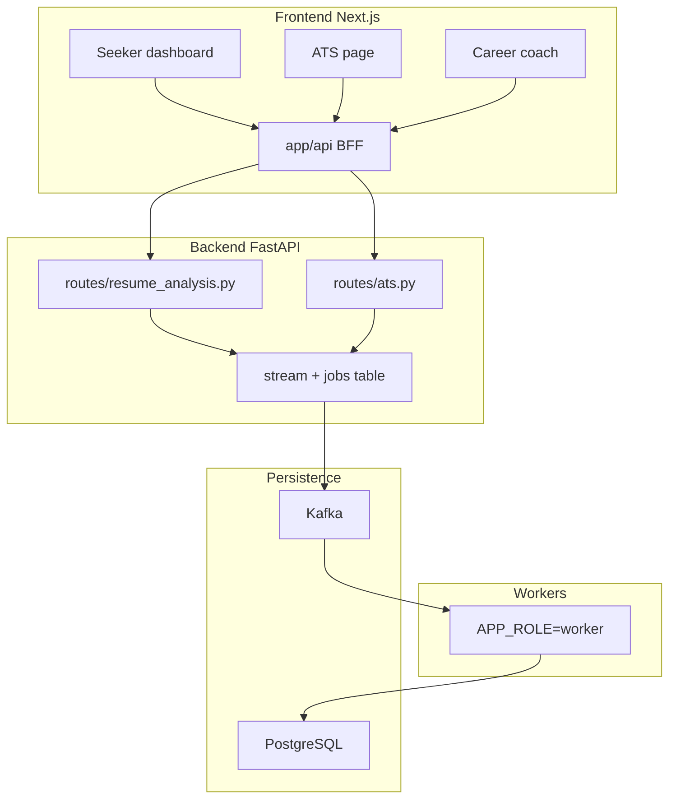
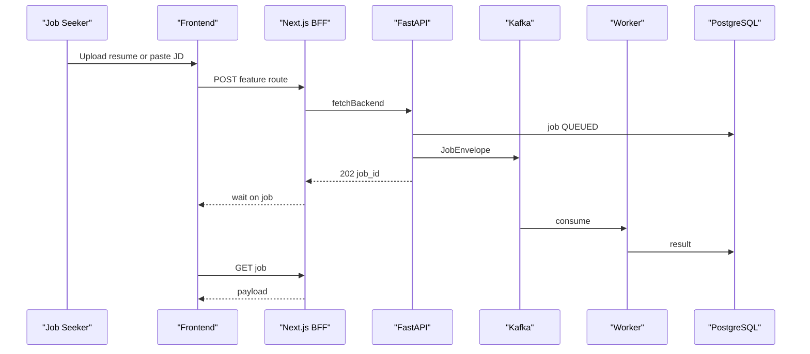
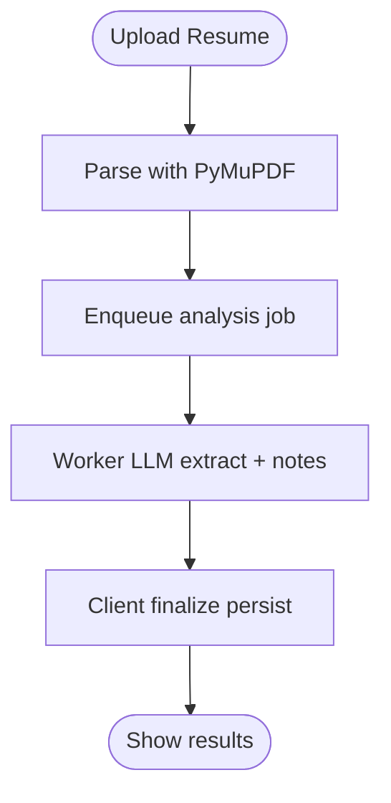
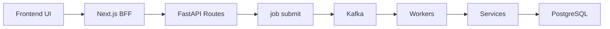

# Key features breakdown

What a job seeker can actually run in this repo, and which files back it.

- Resume analysis and structured extraction
- ATS scoring against a job description
- Tailored resume, enrichment, improvement, Unslop
- Cover letter, cold mail, LinkedIn drafts
- Interview practice and career coach
- PDF resume export
- Metered plans via Razorpay

This is not an employer screening suite. TalentSync-HR owns that. `/dashboard/recruiter` in the frontend is leftover chrome, not the HR product.

## Repository layout

- Frontend: Next.js 16, Bun, Prisma for payments/session hydration
- Backend: FastAPI 3.13, LangChain, LangGraph, FastStream workers
- Jobs: Kafka lanes in `backend/app/stream/topics.py`
- Admin: optional operator console, Compose profile `admin`

```mermaid
graph TB
subgraph "Frontend Next.js"
FE_Seeker["Seeker dashboard"]
FE_ATS["ATS page"]
FE_Coach["Career coach"]
FE_BFF["app/api BFF"]
end
subgraph "Backend FastAPI"
BE_Resume["routes/resume_analysis.py"]
BE_ATS["routes/ats.py"]
BE_Jobs["stream + jobs table"]
end
subgraph "Workers"
W["APP_ROLE=worker"]
end
subgraph "Persistence"
DB["PostgreSQL"]
K["Kafka"]
end
FE_Seeker --> FE_BFF
FE_ATS --> FE_BFF
FE_Coach --> FE_BFF
FE_BFF --> BE_Resume
FE_BFF --> BE_ATS
BE_Resume --> BE_Jobs
BE_ATS --> BE_Jobs
BE_Jobs --> K
K --> W
W --> DB
```

## Building blocks

- Resume analysis
  - PDF/text via PyMuPDF
  - Structured fields, then LLM notes
  - BFF 202, then `POST /api/analysis/finalize` after the job

- ATS
  - Resume plus JD text or URL
  - Score, missing keywords, suggestions
  - Assessment lane on Kafka

- Rewrite tools
  - Tailored resume, JD editor, AI resume editor
  - Enrichment / refine / regenerate
  - `deslopify` is queued Unslop, not a sync formatter

- Outreach
  - Cold mail, cover letter, LinkedIn post/page
  - Communication and social lanes

- Interview and coach
  - Session create, answer eval, summary on the interview lane
  - Token streaming stays on the API process
  - Career coach uses the primary LLM role; titles use the small role

- Billing
  - Razorpay subscriptions and credit packs
  - Backend `feature_gate` is the only meter. The BFF must not double-charge

## How it fits together

```mermaid
sequenceDiagram
participant User as "Job Seeker"
participant UI as "Frontend"
participant API as "Next.js BFF"
participant BE as "FastAPI"
participant K as "Kafka"
participant W as "Worker"
participant DB as "PostgreSQL"
User->>UI : Upload resume or paste JD
UI->>API : POST feature route
API->>BE : fetchBackend
BE->>DB : job QUEUED
BE->>K : JobEnvelope
BE-->>API : 202 job_id
API-->>UI : wait on job
K->>W : consume
W->>DB : result
UI->>API : GET job
API-->>UI : payload
```

## Resume analysis

Accepts PDF and text-like uploads. ZIP bulk ingest is not the seeker happy path; treat multi-file ZIP as leftover from older hiring copy. Analysis is metered and async.

```mermaid
flowchart TD
Start(["Upload Resume"]) --> Parse["Parse with PyMuPDF"]
Parse --> Enqueue["Enqueue analysis job"]
Enqueue --> LLM["Worker LLM extract + notes"]
LLM --> Finalize["Client finalize persist"]
Finalize --> End(["Show results"])
```

## ATS evaluation

Needs a resume and a JD (text or link). Failures are usually an empty JD or a job still `RUNNING`.

## Outreach and documents

Cover letter and cold mail share the communication lane. LinkedIn uses the social lane. PDF generation is a frontend/LaTeX path (`utils/latexGenerator.ts`), not a Kafka LLM job.

## Interview and career coach

Interview graphs live under `backend/app/services/interview/`. Sessions are Postgres (`talentsync_backend.interview_session`), not a process dict. Coach chat streams; title generation uses `SMALL_LLM_*`.

## Metering, not unlimited free

`lib/plans.ts` and `app/services/metering.py` define per-plan caps. Heavy features cost extra credits. 402 `PAYWALL` is the over-quota body.

## Dependencies

```mermaid
graph LR
FE_UI["Frontend UI"] --> FE_API["Next.js BFF"]
FE_API --> BE_ROUTES["FastAPI Routes"]
BE_ROUTES --> JOBS["job submit"]
JOBS --> K["Kafka"]
K --> W["Workers"]
W --> SVC["Services"]
SVC --> DB["PostgreSQL"]
```

## Performance

Long LLM calls do not block `/api/v1/auth/me`. Queue latency is `created_at -> started_at` on the job row. Consumer lag on `ts.worker.resume` is the alert that matters.

## Troubleshooting

- Unsupported file: PDF or text. If the worker never starts, Kafka/worker is down.
- Empty resume text: the parser got no extractable text. Try another PDF.
- LLM 503: `KAFKA_ENABLED` false, or no worker.
- ATS: provide JD text or a reachable link.
- Paywall 402: check plan limits, not a model outage.
