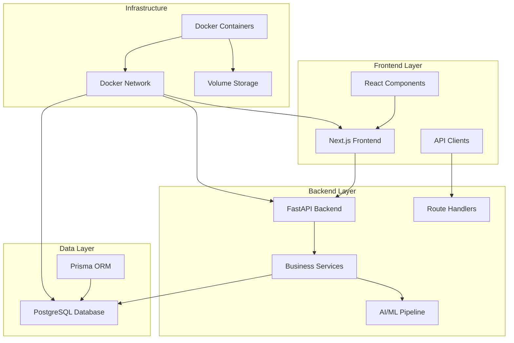
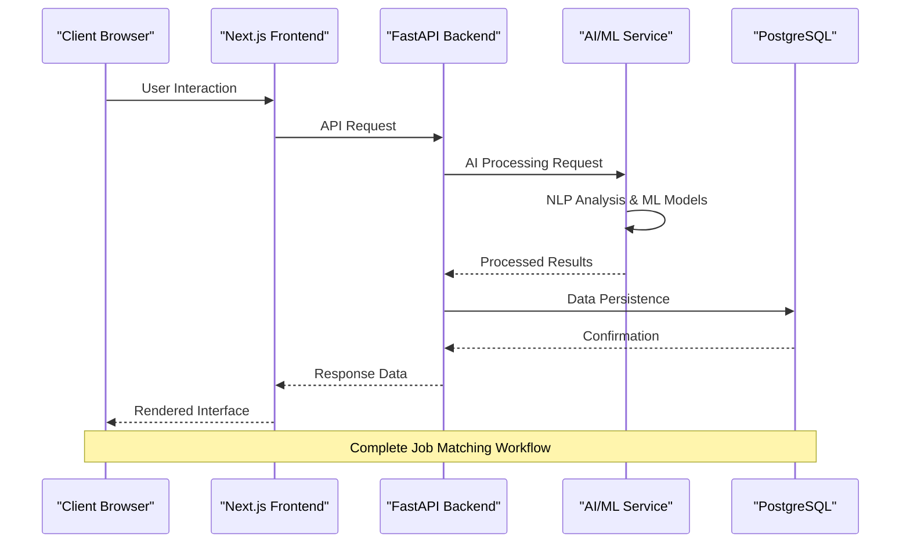
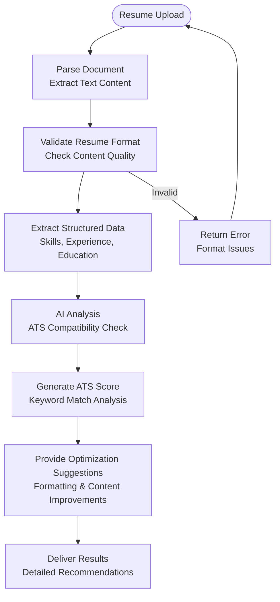
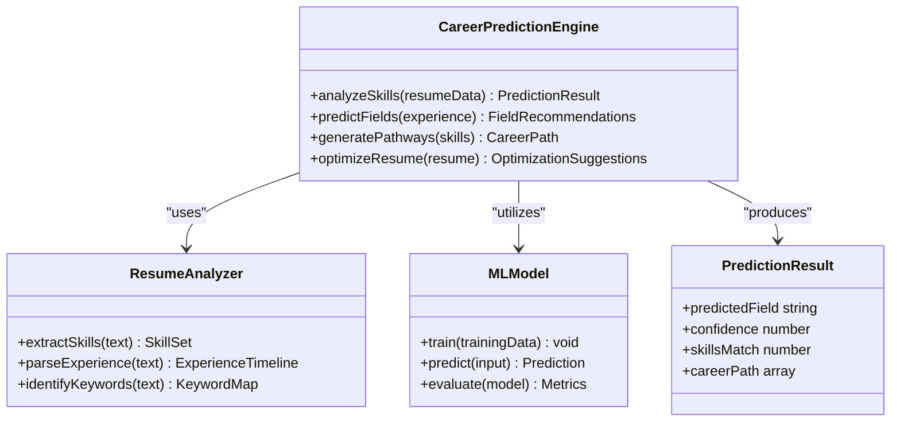
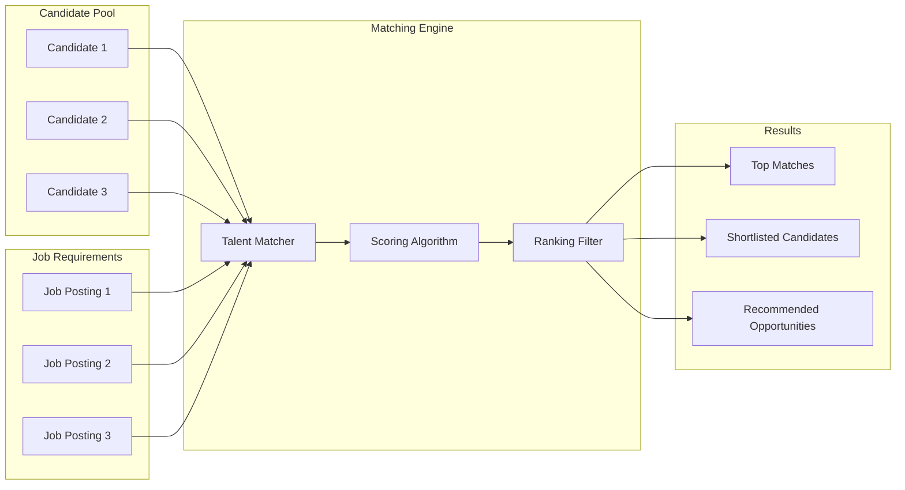
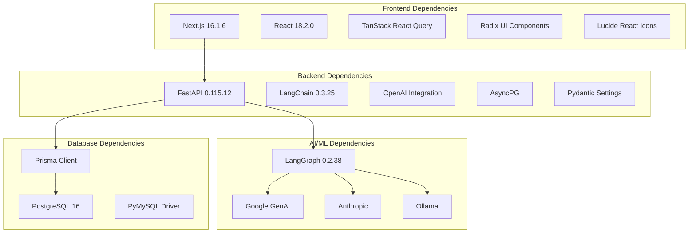

# Project Overview

<cite>
**Referenced Files in This Document**
- [readme.md](file://readme.md)
- [backend/app/main.py](file://backend/app/main.py)
- [backend/pyproject.toml](file://backend/pyproject.toml)
- [docker-compose.yaml](file://docker-compose.yaml)
- [frontend/app/layout.tsx](file://frontend/app/layout.tsx)
- [frontend/package.json](file://frontend/package.json)
- [frontend/app/dashboard/seeker/page.tsx](file://frontend/app/dashboard/seeker/page.tsx)
- [frontend/app/dashboard/recruiter/page.tsx](file://frontend/app/dashboard/recruiter/page.tsx)
- [backend/app/services/resume_analysis.py](file://backend/app/services/resume_analysis.py)
- [frontend/app/api/(backend-interface)/ats/route.ts](file://frontend/app/api/(backend-interface)/ats/route.ts)
- [frontend/services/ats.service.ts](file://frontend/services/ats.service.ts)
- [frontend/hooks/queries/use-ats.ts](file://frontend/hooks/queries/use-ats.ts)
- [backend/app/services/ats.py](file://backend/app/services/ats.py)
- [backend/app/services/ats_evaluator/graph.py](file://backend/app/services/ats_evaluator/graph.py)
- [frontend/components/jd-editor/jd-edit-diff-view.tsx](file://frontend/components/jd-editor/jd-edit-diff-view.tsx)
- [frontend/app/api/(backend-interface)/resume-enrichment/refine/route.ts](file://frontend/app/api/(backend-interface)/resume-enrichment/refine/route.ts)
- [frontend/app/api/(backend-interface)/resume-enrichment/enhance/route.ts](file://frontend/app/api/(backend-interface)/resume-enrichment/enhance/route.ts)
- [frontend/app/api/(backend-interface)/resume-enrichment/regenerate/route.ts](file://frontend/app/api/(backend-interface)/resume-enrichment/regenerate/route.ts)
- [frontend/app/dashboard/recruiter/page.tsx](file://frontend/app/dashboard/recruiter/page.tsx)
</cite>

## Table of Contents
1. [Introduction](#introduction)
2. [Project Structure](#project-structure)
3. [Core Components](#core-components)
4. [Architecture Overview](#architecture-overview)
5. [Detailed Component Analysis](#detailed-component-analysis)
6. [Dependency Analysis](#dependency-analysis)
7. [Performance Considerations](#performance-considerations)
8. [Troubleshooting Guide](#troubleshooting-guide)
9. [Conclusion](#conclusion)

## Introduction
TalentSync-Normies is an AI-powered job matching platform designed to fix broken hiring processes by connecting job seekers and employers through intelligent automation. The platform addresses two major pain points:
- ATS black box rejection: 93% of employers use ATS systems that often reject qualified candidates due to formatting and keyword mismatches
- Manual screening inefficiency: Recruiters manage an average of 49 applications per job with no automated optimization

The platform offers a dual-sided solution:
- **Job Seekers**: AI-powered resume analysis, ATS optimization, career path prediction, and personalized improvement recommendations
- **Employers**: Intelligent talent dashboards, bulk processing capabilities, and pre-vetted candidate ranking to reduce time-to-hire

The core value proposition centers on ATS optimization, career path prediction, and intelligent talent matching that transforms chaos into an efficient, data-driven ecosystem.

## Project Structure
The platform follows a modern microservices architecture with clear separation between frontend, backend, and database layers:

**Diagram sources**
- [docker-compose.yaml](file://docker-compose.yaml#L1-L78)
- [backend/app/main.py](file://backend/app/main.py#L1-L203)
- [frontend/package.json](file://frontend/package.json#L1-L114)

The architecture consists of three primary containers orchestrated by Docker Compose:
- **Frontend Container**: Next.js application serving the user interface
- **Backend Container**: FastAPI server handling business logic and API routing
- **Database Container**: PostgreSQL instance with Prisma ORM for data persistence

**Section sources**
- [docker-compose.yaml](file://docker-compose.yaml#L1-L78)
- [backend/app/main.py](file://backend/app/main.py#L1-L203)
- [frontend/package.json](file://frontend/package.json#L1-L114)

## Core Components
The platform's functionality is built around several key components that work together to deliver intelligent job matching:

### AI/ML Engine
The AI/ML engine serves as the intelligence backbone, utilizing LangChain frameworks for natural language processing and machine learning models for predictive analytics. This component handles:
- Resume parsing and structured data extraction
- ATS optimization analysis and scoring
- Career path prediction based on skills and experience
- Intelligent talent matching algorithms

### Resume Analysis Pipeline
The resume analysis pipeline processes uploaded documents through multiple stages:
1. **Document Parsing**: Support for PDF, TXT, and ZIP formats with automatic extraction
2. **Structured Data Extraction**: NLP-based parsing to extract skills, experience, and qualifications
3. **Quality Assessment**: Validation and cleaning of extracted data
4. **Analysis Generation**: Comprehensive insights and improvement recommendations

### ATS Optimization Engine
The ATS optimization engine specifically targets Applicant Tracking Systems by:
- Analyzing resume keywords against job descriptions
- Scoring resumes for ATS compatibility
- Providing targeted optimization suggestions
- Maintaining format compliance for system parsing

### Career Path Prediction
Using machine learning models, the platform predicts optimal career trajectories:
- Skills gap analysis and recommendations
- Industry field predictions based on experience
- Role recommendation algorithms
- Personalized career development pathways

**Section sources**
- [backend/app/services/resume_analysis.py](file://backend/app/services/resume_analysis.py#L1-L364)
- [backend/pyproject.toml](file://backend/pyproject.toml#L1-L42)

## Architecture Overview
The platform implements a comprehensive microservices architecture designed for scalability and maintainability:

**Diagram sources**
- [backend/app/main.py](file://backend/app/main.py#L157-L203)
- [docker-compose.yaml](file://docker-compose.yaml#L19-L66)

The architecture emphasizes:
- **Separation of Concerns**: Clear boundaries between frontend, backend, and AI services
- **Scalability**: Containerized deployment enabling horizontal scaling
- **Resilience**: Fault-tolerant design with proper error handling
- **Extensibility**: Modular components supporting future feature additions

**Section sources**
- [backend/app/main.py](file://backend/app/main.py#L1-L203)
- [docker-compose.yaml](file://docker-compose.yaml#L1-L78)

## Detailed Component Analysis

### ATS Optimization System
The ATS optimization system represents the platform's core value proposition for both job seekers and employers:

**Diagram sources**
- [backend/app/services/resume_analysis.py](file://backend/app/services/resume_analysis.py#L28-L156)
- [backend/app/services/ats.py](file://backend/app/services/ats.py#L85-L127)

The system processes resumes through multiple validation stages:
1. **Format Validation**: Ensures uploaded files meet parsing requirements
2. **Content Extraction**: Uses NLP to identify skills, experience, and qualifications
3. **ATS Analysis**: Compares extracted content against job description requirements
4. **Optimization Scoring**: Provides quantified recommendations for improvement

**Section sources**
- [backend/app/services/resume_analysis.py](file://backend/app/services/resume_analysis.py#L1-L364)
- [backend/app/services/ats.py](file://backend/app/services/ats.py#L85-L127)

### Career Path Prediction Engine
The career prediction engine leverages machine learning to guide professional development:

**Diagram sources**
- [backend/app/services/resume_analysis.py](file://backend/app/services/resume_analysis.py#L159-L237)

The engine operates through three primary phases:
1. **Skills Analysis**: Identifies technical and soft skills from resume content
2. **Experience Mapping**: Correlates work history with industry requirements
3. **Field Prediction**: Uses trained models to recommend optimal career paths

**Section sources**
- [backend/app/services/resume_analysis.py](file://backend/app/services/resume_analysis.py#L159-L237)

### Intelligent Talent Matching
The talent matching system creates intelligent connections between candidates and opportunities:

**Diagram sources**
- [frontend/app/dashboard/recruiter/page.tsx](file://frontend/app/dashboard/recruiter/page.tsx#L150-L200)

The matching engine considers multiple factors:
- **Technical Skills**: Direct correlation between candidate abilities and job requirements
- **Experience Level**: Years of relevant experience and career progression
- **Location Preferences**: Geographic constraints and relocation willingness
- **Salary Expectations**: Compensation alignment with market rates
- **Company Culture Fit**: Soft skills and personality assessments

**Section sources**
- [frontend/app/dashboard/recruiter/page.tsx](file://frontend/app/dashboard/recruiter/page.tsx#L1-L200)

## Dependency Analysis
The platform's dependency structure reflects its comprehensive feature set and technical requirements:

**Diagram sources**
- [frontend/package.json](file://frontend/package.json#L17-L85)
- [backend/pyproject.toml](file://backend/pyproject.toml#L7-L33)

The dependency analysis reveals:
- **Frontend**: Modern React ecosystem with comprehensive UI component library
- **Backend**: Robust Python stack with specialized AI/ML integrations
- **Database**: Production-ready PostgreSQL with advanced ORM capabilities
- **AI/ML**: Multi-provider support enabling flexible model selection

**Section sources**
- [frontend/package.json](file://frontend/package.json#L1-L114)
- [backend/pyproject.toml](file://backend/pyproject.toml#L1-L42)

## Performance Considerations
The platform incorporates several performance optimization strategies:

### Scalability Features
- **Containerization**: Docker-based deployment enabling horizontal scaling
- **Microservices Architecture**: Independent service scaling based on demand
- **Asynchronous Processing**: Non-blocking operations for AI/ML computations
- **Caching Strategies**: Intelligent caching for frequently accessed data

### Optimization Techniques
- **Batch Processing**: Efficient handling of multiple resume analyses
- **Memory Management**: Optimized resource allocation for AI model inference
- **Database Indexing**: Strategic indexing for rapid query performance
- **CDN Integration**: Static asset delivery optimization

### Monitoring and Analytics
- **Request Tracing**: Comprehensive logging for performance analysis
- **Error Tracking**: Real-time monitoring of system failures
- **Usage Analytics**: Insights into platform adoption and effectiveness
- **Resource Utilization**: Continuous monitoring of compute and memory usage

## Troubleshooting Guide
Common issues and their resolutions:

### ATS Optimization Issues
**Problem**: ATS scores consistently low despite quality resumes
**Solution**: Review optimization suggestions and implement keyword improvements

**Problem**: ATS analysis fails for specific document formats
**Solution**: Convert documents to supported formats (PDF, TXT) and retry

### Performance Issues
**Problem**: Slow response times during peak usage
**Solution**: Scale backend containers and implement caching strategies

**Problem**: Memory exhaustion during AI processing
**Solution**: Monitor resource usage and adjust container limits

### Integration Problems
**Problem**: Database connection failures
**Solution**: Verify connection strings and network connectivity

**Problem**: AI model unavailability
**Solution**: Check provider credentials and API quotas

**Section sources**
- [frontend/services/ats.service.ts](file://frontend/services/ats.service.ts#L1-L17)
- [frontend/hooks/queries/use-ats.ts](file://frontend/hooks/queries/use-ats.ts#L1-L18)

## Conclusion
TalentSync-Normies represents a comprehensive solution to modern hiring challenges through intelligent automation and dual-sided marketplace design. The platform successfully addresses the fundamental problems of ATS black box rejection and manual screening inefficiency by providing:

- **Quantifiable Impact**: Reduces time-to-hire through automated optimization and intelligent matching
- **Scalable Architecture**: Microservices design supporting growth and customization
- **Advanced AI Capabilities**: Multi-provider AI/ML integration for superior analysis
- **Dual-Sided Value**: Benefits both job seekers and employers through complementary features

The platform's technical foundation, combining modern web technologies with sophisticated AI/ML capabilities, positions it as a leader in intelligent job matching technology. Its modular architecture ensures maintainability and extensibility for future enhancements while delivering immediate value through proven optimization techniques.

Through ATS optimization, career path prediction, and intelligent talent matching, TalentSync-Normies transforms the fragmented, inefficient hiring landscape into a streamlined, data-driven ecosystem that benefits all stakeholders in the employment process.