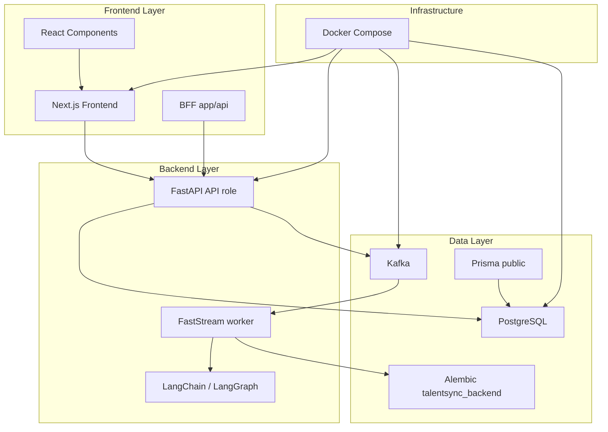
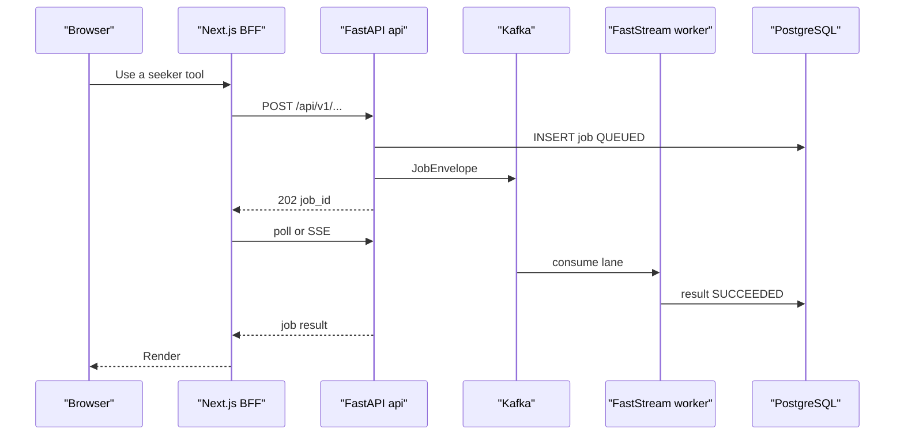
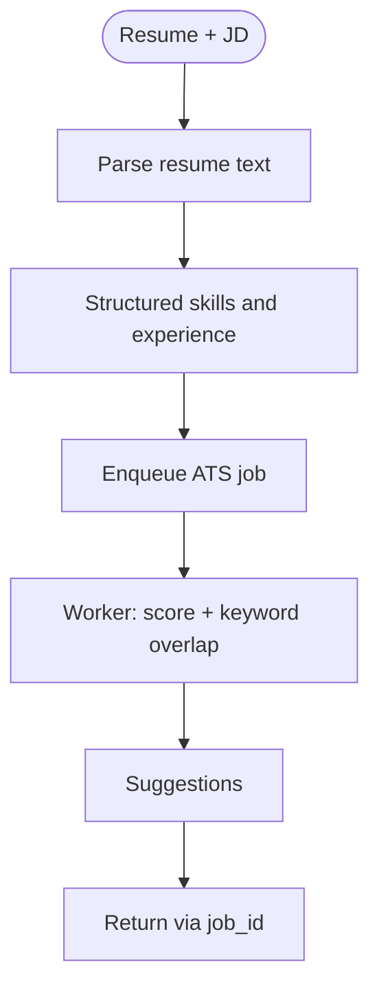
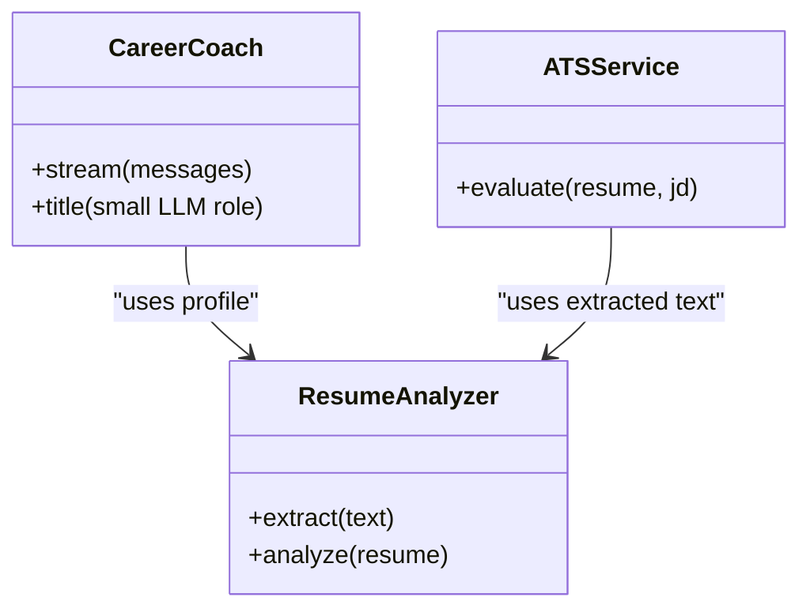
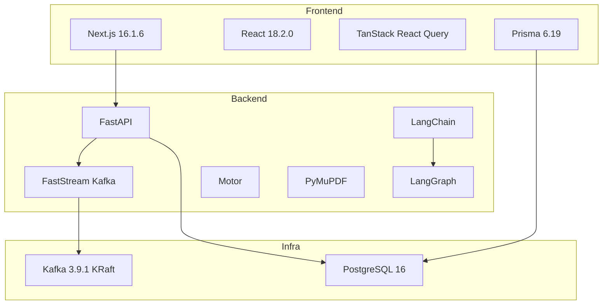

# Project overview

TalentSync is a job-seeker product: resume analysis, ATS scoring, tailored rewrites, outreach drafts, interview practice, and a career coach. Live at https://talentsync.tashif.codes/

It is not TalentSync-HR. That repo is recruiter screening. Do not document bulk employer shortlists or an HR talent pool as this app.

The upstream README still talks about dual-sided hiring and clones `harleenkaur28/AI-Resume-Parser`. Ignore that. This tree is `tashifkhan/TalentSync`.

## Repository layout

```mermaid
graph TB
subgraph "Frontend Layer"
FE_Next[Next.js Frontend]
FE_UI[React Components]
FE_API[BFF app/api]
end
subgraph "Backend Layer"
BE_FastAPI[FastAPI API role]
BE_Worker[FastStream worker]
BE_AI[LangChain / LangGraph]
end
subgraph "Data Layer"
DB_PostgreSQL[PostgreSQL]
DB_Prisma[Prisma public]
DB_Jobs[Alembic talentsync_backend]
K[Kafka]
end
subgraph "Infrastructure"
INF_Docker[Docker Compose]
end
FE_Next --> BE_FastAPI
FE_UI --> FE_Next
FE_API --> BE_FastAPI
BE_FastAPI --> K
K --> BE_Worker
BE_Worker --> BE_AI
BE_Worker --> DB_Jobs
BE_FastAPI --> DB_PostgreSQL
DB_Prisma --> DB_PostgreSQL
INF_Docker --> BE_FastAPI
INF_Docker --> FE_Next
INF_Docker --> DB_PostgreSQL
INF_Docker --> K
```

Compose local services: `db`, `kafka`, `backend` (`APP_ROLE=api`), `worker` (`APP_ROLE=worker`), `frontend`. Admin and observability are Compose profiles, not the seeker app.

## Building blocks

### AI pipelines

LangChain / LangGraph behind FastAPI routes. Workers run the slow ones. Streaming chat and interview SSE stay on the API process.

Seeker tools that enqueue:

- Resume analysis, improvement, enrichment, tailored resume, Unslop (`deslopify`)
- ATS evaluation and tips
- Cover letter, cold mail, LinkedIn
- Interview session create / answer eval / summary
- Hiring-assistant answers (practice copy, not an employer inbox)

### Resume analysis

PDF/text through PyMuPDF, then structured extraction, then LLM feedback. The BFF returns 202; the client waits on the job, then finalize persists the row.

### ATS optimization

Keyword overlap, compatibility score, and concrete edits against a job description. Same Kafka assessment lane as tips.

### Career coach

Primary LLM role for long answers. Small LLM role (`SMALL_LLM_*`, default `gemini-3.1-flash-lite`) for conversation titles only.

## How it fits together

```mermaid
sequenceDiagram
participant Client as "Browser"
participant Frontend as "Next.js BFF"
participant Backend as "FastAPI api"
participant Kafka as "Kafka"
participant Worker as "FastStream worker"
participant Database as "PostgreSQL"
Client->>Frontend : Use a seeker tool
Frontend->>Backend : POST /api/v1/...
Backend->>Database : INSERT job QUEUED
Backend->>Kafka : JobEnvelope
Backend-->>Frontend : 202 job_id
Frontend->>Backend : poll or SSE
Kafka->>Worker : consume lane
Worker->>Database : result SUCCEEDED
Backend-->>Frontend : job result
Frontend-->>Client : Render
```

Design that actually shows up in the repo:

- One backend image, `APP_ROLE` selects api / worker / migrate
- Prisma owns `public`; Alembic owns `talentsync_backend`
- BYOK keys are encrypted on the job row, never in Kafka
- Google OAuth on FastAPI. NextAuth is gone

## ATS optimization system

```mermaid
flowchart TD
Start([Resume + JD]) --> Parse["Parse resume text"]
Parse --> Extract["Structured skills and experience"]
Extract --> Analyze["Enqueue ATS job"]
Analyze --> Score["Worker: score + keyword overlap"]
Score --> Optimize["Suggestions"]
Optimize --> Output["Return via job_id"]
```

## Career path prediction engine

`analysis/` still has a scikit-learn pickle (`best_model.pkl`, TF-IDF) from the older classifier. Live product paths go through LangChain services, not that notebook, unless you explicitly run `analysis/app.py`.

```mermaid
classDiagram
class CareerCoach {
+stream(messages)
+title(small LLM role)
}
class ResumeAnalyzer {
+extract(text)
+analyze(resume)
}
class ATSService {
+evaluate(resume, jd)
}
CareerCoach --> ResumeAnalyzer : "uses profile"
ATSService --> ResumeAnalyzer : "uses extracted text"
```

## What this product does not do

No employer talent marketplace. No ZIP-of-hundreds recruiter ingest as the main story. `/dashboard/recruiter` in this frontend is leftover navigation, not TalentSync-HR.

## Dependencies

```mermaid
graph TB
subgraph "Frontend"
FE_Next[Next.js 16.1.6]
FE_React[React 18.2.0]
FE_Query[TanStack React Query]
FE_Prisma[Prisma 6.19]
end
subgraph "Backend"
BE_FastAPI[FastAPI]
BE_LangChain[LangChain]
BE_LangGraph[LangGraph]
BE_FS[FastStream Kafka]
BE_Motor[Motor]
BE_PyMuPDF[PyMuPDF]
end
subgraph "Infra"
DB_PostgreSQL[PostgreSQL 16]
KAFKA[Kafka 3.9.1 KRaft]
end
FE_Next --> BE_FastAPI
BE_FastAPI --> BE_FS
BE_FS --> KAFKA
BE_LangChain --> BE_LangGraph
BE_FastAPI --> DB_PostgreSQL
FE_Prisma --> DB_PostgreSQL
```

- Frontend: Next.js, React Query, Radix, Prisma, Razorpay
- Backend: FastAPI, LangChain, LangGraph, Motor, PyMuPDF, FastStream
- Auth: backend Google OAuth, httpOnly JWTs, Next rewrite `/api/v1/:path*`

## Performance

API stays thin: validate, meter, enqueue. Workers scale by lane in prod (`worker_resume`, `worker_assessment`, `worker_comms`). Enrichments can run for minutes; Kafka `max.poll.interval` is 30 minutes.

## Troubleshooting

**ATS scores look wrong.** Fix keywords and format, re-run. The job must `SUCCEEDED` first.

**Analysis 503.** Kafka disabled or no worker. Set `KAFKA_ENABLED=true` and start `APP_ROLE=worker`.

**Login fails.** Google redirect URI and `JWT_SECRET` / `BACKEND_JWT_SECRET` must match. This is not a NextAuth misconfig.

**Compose name clash.** Prod file uses `talentsync_*` containers so TalentSync-HR (`talentsync_hr_*`) can share a Docker host.
