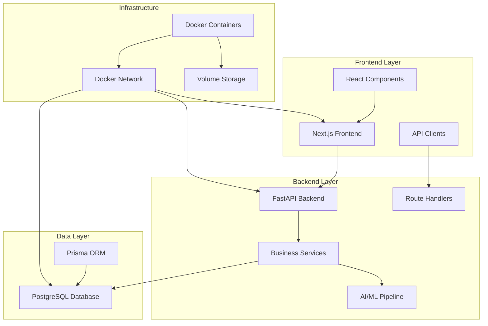
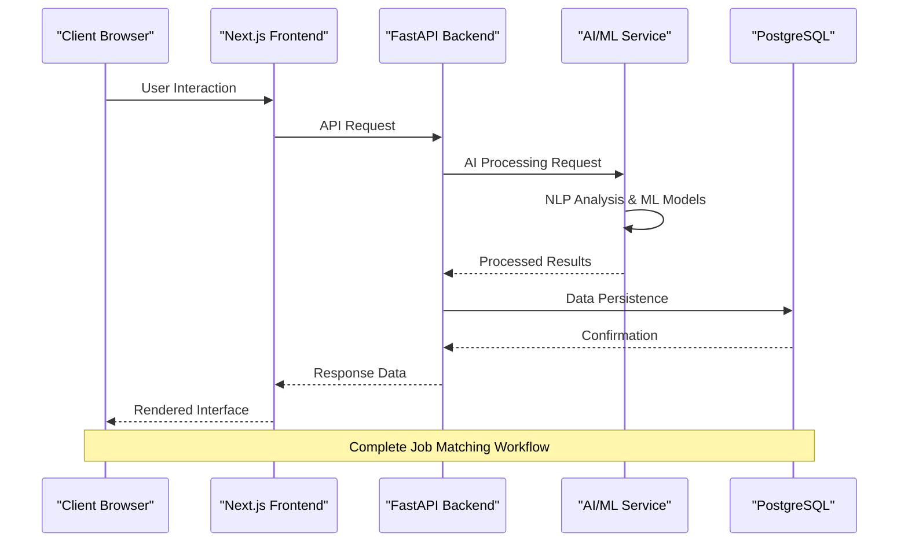
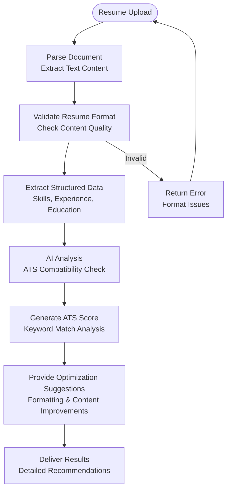
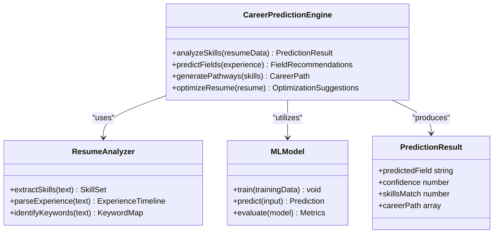
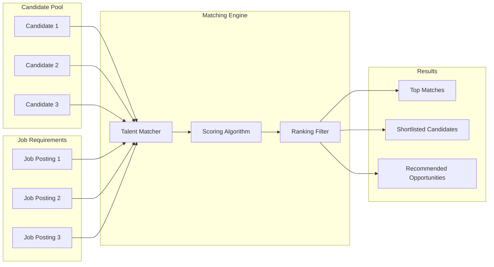
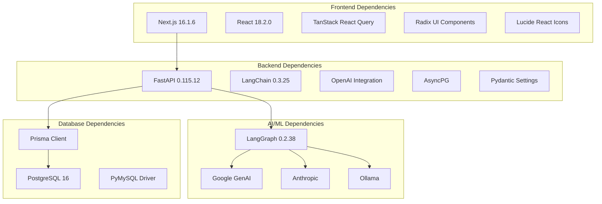

# Project overview

## Introduction
TalentSync-Normies is an AI-powered job matching platform designed to fix broken hiring processes by connecting job seekers and employers through intelligent automation. The platform addresses two major pain points:
- ATS black box rejection: 93% of employers use ATS systems that often reject qualified candidates due to formatting and keyword mismatches
- Manual screening inefficiency: Recruiters manage an average of 49 applications per job with no automated optimization

The platform offers a dual-sided solution:
- **Job Seekers**: AI-powered resume analysis, ATS optimization, career path prediction, and personalized improvement recommendations
- **Employers**: Intelligent talent dashboards, bulk processing capabilities, and pre-vetted candidate ranking to reduce time-to-hire

The core value proposition centers on ATS optimization, career path prediction, and intelligent talent matching that transforms chaos into an efficient, data-driven ecosystem.

## Project structure
The platform follows a modern microservices architecture with clear separation between frontend, backend, and database layers:

```mermaid
graph TB
subgraph "Frontend Layer"
FE_Next[Next.js Frontend]
FE_UI[React Components]
FE_API[API Clients]
end
subgraph "Backend Layer"
BE_FastAPI[FastAPI Backend]
BE_Routes[Route Handlers]
BE_Services[Business Services]
BE_AI[AI/ML Pipeline]
end
subgraph "Data Layer"
DB_PostgreSQL[PostgreSQL Database]
DB_Prisma[Prisma ORM]
end
subgraph "Infrastructure"
INF_Docker[Docker Containers]
INF_Network[Docker Network]
INF_Volume[Volume Storage]
end
FE_Next --> BE_FastAPI
FE_UI --> FE_Next
FE_API --> BE_Routes
BE_FastAPI --> BE_Services
BE_Services --> BE_AI
BE_Services --> DB_PostgreSQL
DB_Prisma --> DB_PostgreSQL
INF_Docker --> INF_Network
INF_Docker --> INF_Volume
INF_Network --> BE_FastAPI
INF_Network --> FE_Next
INF_Network --> DB_PostgreSQL
```

The architecture consists of three primary containers orchestrated by Docker Compose:
- **Frontend Container**: Next.js application serving the user interface
- **Backend Container**: FastAPI server handling business logic and API routing
- **Database Container**: PostgreSQL instance with Prisma ORM for data persistence

## Core components
The platform's functionality is built around several key components that work together to deliver intelligent job matching:

### AI/ML engine
The AI/ML engine is the intelligence backbone, using LangChain frameworks for natural language processing and machine learning models for predictive analytics. This component handles:
- Resume parsing and structured data extraction
- ATS optimization analysis and scoring
- Career path prediction based on skills and experience
- Intelligent talent matching algorithms

### Resume analysis pipeline
The resume analysis pipeline processes uploaded documents through multiple stages:
1. **Document Parsing**: Support for PDF, TXT, and ZIP formats with automatic extraction
2. **Structured Data Extraction**: NLP-based parsing to extract skills, experience, and qualifications
3. **Quality Assessment**: Validation and cleaning of extracted data
4. **Analysis Generation**: Detailed insights and improvement recommendations

### ATS optimization engine
The ATS optimization engine specifically targets Applicant Tracking Systems by:
- Analyzing resume keywords against job descriptions
- Scoring resumes for ATS compatibility
- Providing targeted optimization suggestions
- Maintaining format compliance for system parsing

### Career path prediction
Using machine learning models, the platform predicts optimal career trajectories:
- Skills gap analysis and recommendations
- Industry field predictions based on experience
- Role recommendation algorithms
- Personalized career development pathways

## Architecture overview
The platform implements a detailed microservices architecture designed for scalability and maintainability:

```mermaid
sequenceDiagram
participant Client as "Client Browser"
participant Frontend as "Next.js Frontend"
participant Backend as "FastAPI Backend"
participant AI as "AI/ML Service"
participant Database as "PostgreSQL"
Client->>Frontend : User Interaction
Frontend->>Backend : API Request
Backend->>AI : AI Processing Request
AI->>AI : NLP Analysis & ML Models
AI-->>Backend : Processed Results
Backend->>Database : Data Persistence
Database-->>Backend : Confirmation
Backend-->>Frontend : Response Data
Frontend-->>Client : Rendered Interface
Note over Client,Database : Complete Job Matching Workflow
```

The architecture emphasizes:
- **Separation of Concerns**: Clear boundaries between frontend, backend, and AI services
- **Scalability**: Containerized deployment enabling horizontal scaling
- **Resilience**: Fault-tolerant design with proper error handling
- **Extensibility**: Modular components supporting future feature additions

## Detailed component analysis

### ATS optimization system
The ATS optimization system represents the platform's core value proposition for both job seekers and employers:

```mermaid
flowchart TD
Start([Resume Upload]) --> Parse["Parse Document<br/>Extract Text Content"]
Parse --> Validate["Validate Resume Format<br/>Check Content Quality"]
Validate --> Extract["Extract Structured Data<br/>Skills, Experience, Education"]
Extract --> Analyze["AI Analysis<br/>ATS Compatibility Check"]
Analyze --> Score["Generate ATS Score<br/>Keyword Match Analysis"]
Score --> Optimize["Provide Optimization Suggestions<br/>Formatting & Content Improvements"]
Optimize --> Output["Deliver Results<br/>Detailed Recommendations"]
Validate --> |Invalid| Error["Return Error<br/>Format Issues"]
Error --> Start
```

The system processes resumes through multiple validation stages:
1. **Format Validation**: Ensures uploaded files meet parsing requirements
2. **Content Extraction**: Uses NLP to identify skills, experience, and qualifications
3. **ATS Analysis**: Compares extracted content against job description requirements
4. **Optimization Scoring**: Provides quantified recommendations for improvement

### Career path prediction engine
The career prediction engine uses machine learning to guide professional development:

```mermaid
classDiagram
class CareerPredictionEngine {
+analyzeSkills(resumeData) PredictionResult
+predictFields(experience) FieldRecommendations
+generatePathways(skills) CareerPath
+optimizeResume(resume) OptimizationSuggestions
}
class ResumeAnalyzer {
+extractSkills(text) SkillSet
+parseExperience(text) ExperienceTimeline
+identifyKeywords(text) KeywordMap
}
class MLModel {
+train(trainingData) void
+predict(input) Prediction
+evaluate(model) Metrics
}
class PredictionResult {
+predictedField string
+confidence number
+skillsMatch number
+careerPath array
}
CareerPredictionEngine --> ResumeAnalyzer : "uses"
CareerPredictionEngine --> MLModel : "utilizes"
CareerPredictionEngine --> PredictionResult : "produces"
```

The engine operates through three primary phases:
1. **Skills Analysis**: Identifies technical and soft skills from resume content
2. **Experience Mapping**: Correlates work history with industry requirements
3. **Field Prediction**: Uses trained models to recommend optimal career paths

### Intelligent talent matching
The talent matching system creates intelligent connections between candidates and opportunities:

```mermaid
graph LR
subgraph "Candidate Pool"
C1[Candidate 1]
C2[Candidate 2]
C3[Candidate 3]
end
subgraph "Job Requirements"
J1[Job Posting 1]
J2[Job Posting 2]
J3[Job Posting 3]
end
subgraph "Matching Engine"
ME[Talent Matcher]
SC[Scoring Algorithm]
RF[Ranking Filter]
end
subgraph "Results"
R1[Top Matches]
R2[Shortlisted Candidates]
R3[Recommended Opportunities]
end
C1 --> ME
C2 --> ME
C3 --> ME
J1 --> ME
J2 --> ME
J3 --> ME
ME --> SC
SC --> RF
RF --> R1
RF --> R2
RF --> R3
```

The matching engine considers multiple factors:
- **Technical Skills**: Direct correlation between candidate abilities and job requirements
- **Experience Level**: Years of relevant experience and career progression
- **Location Preferences**: Geographic constraints and relocation willingness
- **Salary Expectations**: Compensation alignment with market rates
- **Company Culture Fit**: Soft skills and personality assessments

## Dependency analysis
The platform's dependency structure reflects its detailed feature set and technical requirements:

```mermaid
graph TB
subgraph "Frontend Dependencies"
FE_Next[Next.js 16.1.6]
FE_React[React 18.2.0]
FE_Query[TanStack React Query]
FE_UI[Radix UI Components]
FE_Icons[Lucide React Icons]
end
subgraph "Backend Dependencies"
BE_FastAPI[FastAPI 0.115.12]
BE_LangChain[LangChain 0.3.25]
BE_OpenAI[OpenAI Integration]
BE_AsyncPG[AsyncPG]
BE_Pydantic[Pydantic Settings]
end
subgraph "AI/ML Dependencies"
AI_LangGraph[LangGraph 0.2.38]
AI_GoogleGenAI[Google GenAI]
AI_Anthropic[Anthropic]
AI_Ollama[Ollama]
end
subgraph "Database Dependencies"
DB_PostgreSQL[PostgreSQL 16]
DB_Prisma[Prisma Client]
DB_PyMySQL[PyMySQL Driver]
end
FE_Next --> BE_FastAPI
BE_FastAPI --> AI_LangGraph
AI_LangGraph --> AI_GoogleGenAI
AI_LangGraph --> AI_Anthropic
AI_LangGraph --> AI_Ollama
BE_FastAPI --> DB_Prisma
DB_Prisma --> DB_PostgreSQL
```

The dependency analysis reveals:
- **Frontend**: Modern React ecosystem with detailed UI component library
- **Backend**: Reliable Python stack with specialized AI/ML integrations
- **Database**: Production-ready PostgreSQL with advanced ORM capabilities
- **AI/ML**: Multi-provider support enabling flexible model selection

## Performance considerations
The platform incorporates several performance optimization strategies:

### Scalability features
- **Containerization**: Docker-based deployment enabling horizontal scaling
- **Microservices Architecture**: Independent service scaling based on demand
- **Asynchronous Processing**: Non-blocking operations for AI/ML computations
- **Caching Strategies**: Intelligent caching for frequently accessed data

### Optimization techniques
- **Batch Processing**: Efficient handling of multiple resume analyses
- **Memory Management**: Optimized resource allocation for AI model inference
- **Database Indexing**: Strategic indexing for rapid query performance
- **CDN Integration**: Static asset delivery optimization

### Monitoring and analytics
- **Request Tracing**: Detailed logging for performance analysis
- **Error Tracking**: Real-time monitoring of system failures
- **Usage Analytics**: Insights into platform adoption and effectiveness
- **Resource Utilization**: Continuous monitoring of compute and memory usage

## Troubleshooting guide
Common issues and their resolutions:

### ATS optimization issues
**Problem**: ATS scores consistently low despite quality resumes
**Solution**: Review optimization suggestions and implement keyword improvements

**Problem**: ATS analysis fails for specific document formats
**Solution**: Convert documents to supported formats (PDF, TXT) and retry

### Performance issues
**Problem**: Slow response times during peak usage
**Solution**: Scale backend containers and implement caching strategies

**Problem**: Memory exhaustion during AI processing
**Solution**: Monitor resource usage and adjust container limits

### Integration problems
**Problem**: Database connection failures
**Solution**: Verify connection strings and network connectivity

**Problem**: AI model unavailability
**Solution**: Check provider credentials and API quotas

## Conclusion
TalentSync-Normies represents a detailed solution to modern hiring challenges through intelligent automation and dual-sided marketplace design. The platform successfully addresses the fundamental problems of ATS black box rejection and manual screening inefficiency by providing:

- **Quantifiable Impact**: Reduces time-to-hire through automated optimization and intelligent matching
- **Scalable Architecture**: Microservices design supporting growth and customization
- **Advanced AI Capabilities**: Multi-provider AI/ML integration for superior analysis
- **Dual-Sided Value**: Benefits both job seekers and employers through complementary features

The platform's technical foundation, combining modern web technologies with sophisticated AI/ML capabilities, positions it as a leader in intelligent job matching technology. Its modular architecture ensures maintainability and extensibility for future enhancements while delivering immediate value through proven optimization techniques.

Through ATS optimization, career path prediction, and intelligent talent matching, TalentSync-Normies transforms the fragmented, inefficient hiring landscape into a streamlined, data-driven ecosystem that benefits all stakeholders in the employment process.
