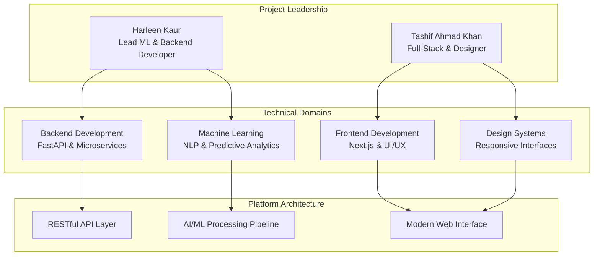
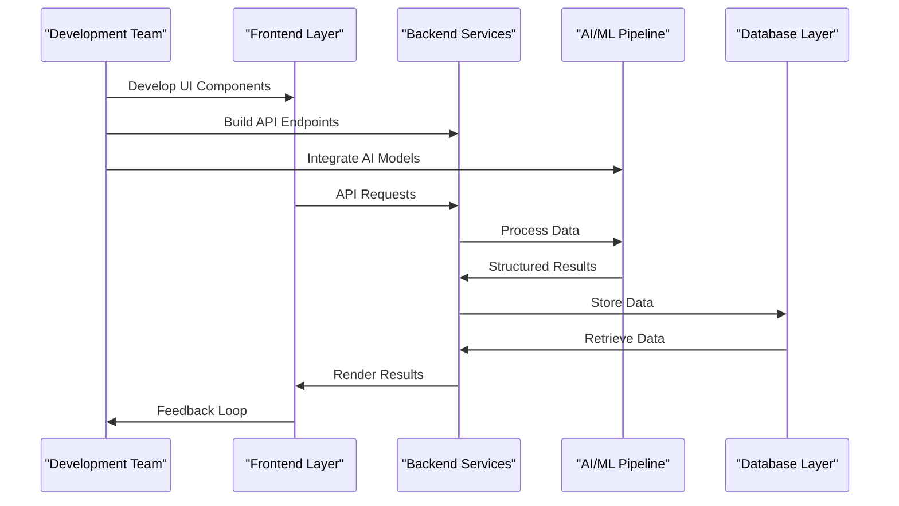
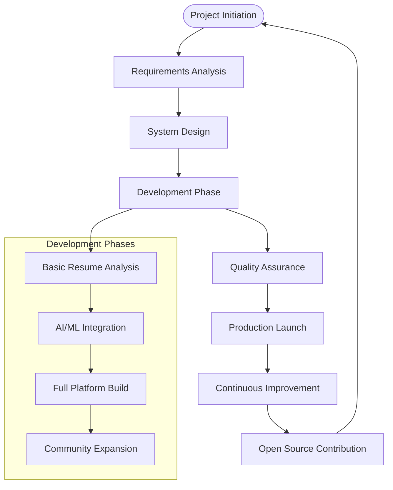

# Team and Acknowledgments

<cite>
**Referenced Files in This Document**
- [readme.md](file://readme.md)
- [AGENTS.md](file://AGENTS.md)
- [backend/app/main.py](file://backend/app/main.py)
- [backend/pyproject.toml](file://backend/pyproject.toml)
- [frontend/package.json](file://frontend/package.json)
- [LICENSE](file://LICENSE)
</cite>

## Table of Contents
1. [Introduction](#introduction)
2. [Leadership Structure](#leadership-structure)
3. [Development Approach](#development-approach)
4. [Technology Stack Acknowledgments](#technology-stack-acknowledgments)
5. [Open Source Community Recognition](#open-source-community-recognition)
6. [Project Origins and Timeline](#project-origins-and-timeline)
7. [Conclusion](#conclusion)

## Introduction

TalentSync-Normies is a collaborative AI-powered platform designed to transform the modern hiring landscape by connecting talent to opportunity through intelligent automation. This document recognizes the dedicated team behind the technology and acknowledges the open-source community that enables our innovation.

## Leadership Structure

The project is guided by two principal contributors who bring complementary expertise to drive the platform's development forward.

**Harleen Kaur** serves as the Lead Developer, focusing on machine learning and backend development. Her leadership encompasses:
- Core AI/ML pipeline architecture and implementation
- Backend API design and FastAPI framework management
- Machine learning model integration and optimization
- Data processing workflows and NLP pipeline orchestration
- System architecture decisions and technical roadmap guidance

**Tashif Ahmad Khan** contributes as a Full-Stack Developer with design expertise, handling:
- Frontend application development with Next.js and modern React patterns
- User interface design and user experience optimization
- Cross-platform compatibility and responsive design implementation
- Integration between frontend and backend systems
- Performance optimization and deployment strategies

**Diagram sources**
- [backend/app/main.py](file://backend/app/main.py#L157-L203)
- [AGENTS.md](file://AGENTS.md#L15-L92)

**Section sources**
- [readme.md](file://readme.md#L143-L149)

## Development Approach

The team employs a collaborative, agile development methodology that emphasizes:

**Modular Architecture**: The platform follows a clear separation of concerns with distinct frontend and backend components, enabling parallel development and independent scaling.

**Cross-Functional Collaboration**: Team members work together on feature development, with ML expertise integrated alongside full-stack development to ensure cohesive functionality.

**Quality Assurance**: Both frontend and backend components maintain strict type safety and validation, with comprehensive testing approaches for both UI components and API endpoints.

**Continuous Integration**: The development workflow incorporates automated verification processes for both frontend TypeScript compilation and backend Python syntax checking.

**Diagram sources**
- [AGENTS.md](file://AGENTS.md#L78-L90)
- [backend/app/main.py](file://backend/app/main.py#L157-L203)

**Section sources**
- [AGENTS.md](file://AGENTS.md#L1-L175)

## Technology Stack Acknowledgments

The platform leverages cutting-edge technologies that form the foundation of our intelligent talent matching system:

**Frontend Technologies**:
- Next.js for modern React application development
- Tailwind CSS for utility-first styling and responsive design
- Shadcn UI components for consistent design patterns
- Framer Motion for smooth animations and transitions
- Chart.js for data visualization capabilities

**Backend Infrastructure**:
- FastAPI for high-performance API development
- PostgreSQL for robust data persistence
- Prisma for type-safe database operations
- LangChain for AI/ML pipeline orchestration
- Scikit-learn for machine learning model implementation

**AI/ML Capabilities**:
- spaCy for natural language processing
- Generative AI models for content creation
- Predictive analytics for career path modeling
- NLP algorithms for resume analysis and parsing

**Development Tools**:
- Bun for fast JavaScript package management
- uv for efficient Python dependency management
- Docker for containerized deployment
- Modern CI/CD workflows for automated testing

**Section sources**
- [frontend/package.json](file://frontend/package.json#L17-L86)
- [backend/pyproject.toml](file://backend/pyproject.toml#L7-L33)

## Open Source Community Recognition

TalentSync-Normies stands on the shoulders of giants from the open-source community. We acknowledge and thank:

**Core Framework Contributors**: The maintainers and contributors of Next.js, FastAPI, and PostgreSQL for providing the foundational technologies that make our platform possible.

**AI/ML Ecosystem**: The developers behind LangChain, scikit-learn, spaCy, and other machine learning libraries that enable intelligent automation and analysis.

**UI/UX Innovation**: The creators of Tailwind CSS, Shadcn UI, and design systems that inspire modern, accessible user interfaces.

**Developer Tooling**: The teams behind Bun, uv, Docker, and other development tools that streamline our workflow and deployment processes.

**Community Support**: The broader developer community that shares knowledge, creates tutorials, and maintains documentation that helps us build better software.

## Project Origins and Timeline

While the current repository represents a consolidated effort, the project evolved from collaborative development practices that emphasize:

**Initial Foundation**: The project began as a focused initiative combining machine learning expertise with full-stack development capabilities to address real-world hiring challenges.

**Iterative Development**: Through continuous refinement and feature expansion, the platform grew from basic resume analysis tools to a comprehensive talent matching ecosystem.

**Community Integration**: The project has evolved to embrace open collaboration, with clear contribution guidelines and development standards that welcome community participation.

**Current Status**: The platform continues to evolve with regular updates, feature enhancements, and community-driven improvements that strengthen its position as a leading AI-powered talent solution.

**Section sources**
- [readme.md](file://readme.md#L21-L25)

## Conclusion

The success of TalentSync-Normies reflects the power of collaborative development and the strength of the open-source ecosystem. Through the dedicated efforts of Harleen Kaur and Tashif Ahmad Khan, along with the broader community of contributors and maintainers, we continue to push the boundaries of what's possible in AI-powered talent matching.

We invite the community to engage with the project, contribute ideas and code, and help shape the future of intelligent recruitment technology. Together, we can build a more efficient, fair, and effective hiring ecosystem that benefits both job seekers and employers.

---

**Section sources**
- [LICENSE](file://LICENSE#L1-L662)