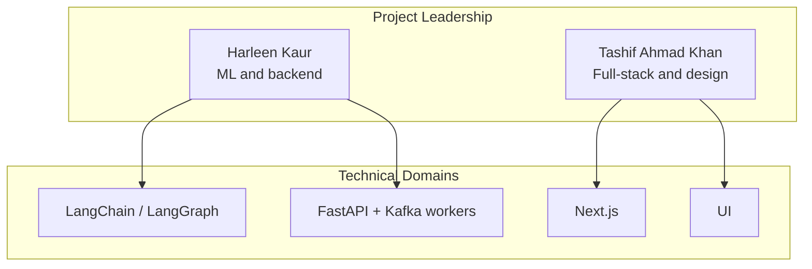
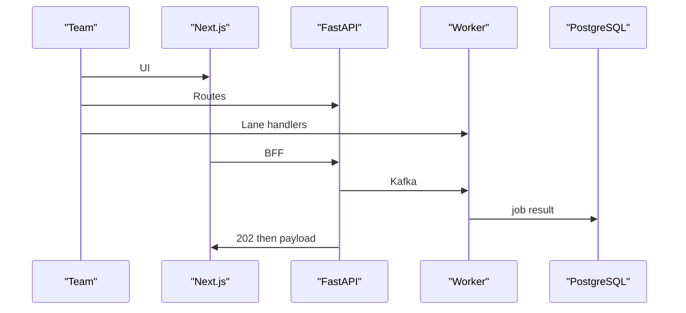
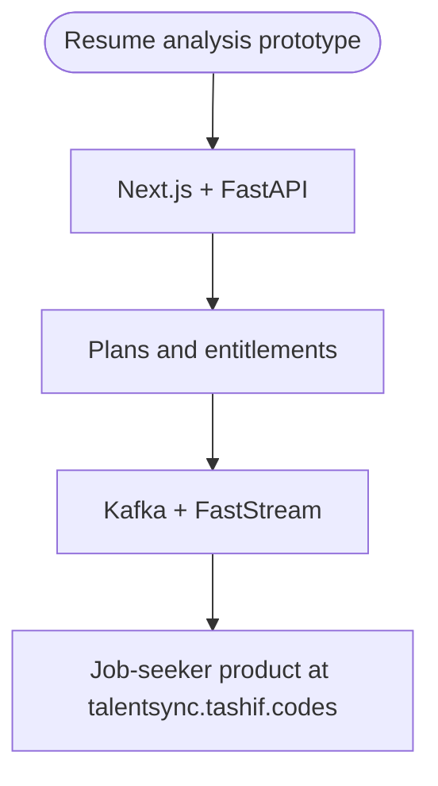

# Team and acknowledgments

TalentSync (job-seeker app) is a small team plus a lot of other people's libraries.

## Leadership

**Harleen Kaur** leads machine learning and backend work:

- FastAPI services and LangChain graphs
- Model wiring and prompts
- Job/worker path with FastStream

**Tashif Ahmad Khan** covers full-stack and design:

- Next.js UI
- BFF routes, billing, deploy
- https://talentsync.tashif.codes/

```mermaid
graph TB
subgraph "Project Leadership"
HK["Harleen Kaur<br/>ML and backend"]
TAK["Tashif Ahmad Khan<br/>Full-stack and design"]
end
subgraph "Technical Domains"
ML["LangChain / LangGraph"]
BD["FastAPI + Kafka workers"]
FD["Next.js"]
DS["UI"]
end
HK --> ML
HK --> BD
TAK --> FD
TAK --> DS
```

## How the team works

Frontend and backend are separate packages and containers. New LLM behavior lands behind FastAPI routes the BFF already forwards. TypeScript on the UI, Pydantic on the API. Bun and uv in CI.

Do not point agents at TalentSync-HR paths when editing this tree.

```mermaid
sequenceDiagram
participant Team as "Team"
participant Frontend as "Next.js"
participant Backend as "FastAPI"
participant Worker as "Worker"
participant DB as "PostgreSQL"
Team->>Frontend : UI
Team->>Backend : Routes
Team->>Worker : Lane handlers
Frontend->>Backend : BFF
Backend->>Worker : Kafka
Worker->>DB : job result
Backend->>Frontend : 202 then payload
```

## Technology stack

**Frontend**

- Next.js 16, React 18.2
- Tailwind, Shadcn/Radix
- Prisma, TanStack Query, Razorpay
- Bun

**Backend**

- Python >=3.13, FastAPI
- LangChain, LangGraph
- FastStream + Kafka
- SQLModel/Alembic, Motor, PyMuPDF
- uv

**AI**

- Multi-provider LLM factory
- Primary vs small model roles
- Prompt modules under `backend/app/data/prompt/`

**Tooling**

- Docker Compose (dev, prod, host-infra)
- GitHub Actions deploy to a VPS

## Open source thanks

Next.js, FastAPI, PostgreSQL, Kafka, LangChain, Prisma, Tailwind, Radix, Bun, uv.

## Origins

Started as resume analysis plus a usable web app. The current split (Next.js BFF, FastAPI, Kafka workers) is what ships. The README clone URL `harleenkaur28/AI-Resume-Parser` is stale; use https://github.com/tashifkhan/TalentSync.

```mermaid
flowchart TD
Start(["Resume analysis prototype"]) --> Web["Next.js + FastAPI"]
Web --> Meter["Plans and entitlements"]
Meter --> Jobs["Kafka + FastStream"]
Jobs --> Now["Job-seeker product at talentsync.tashif.codes"]
```
