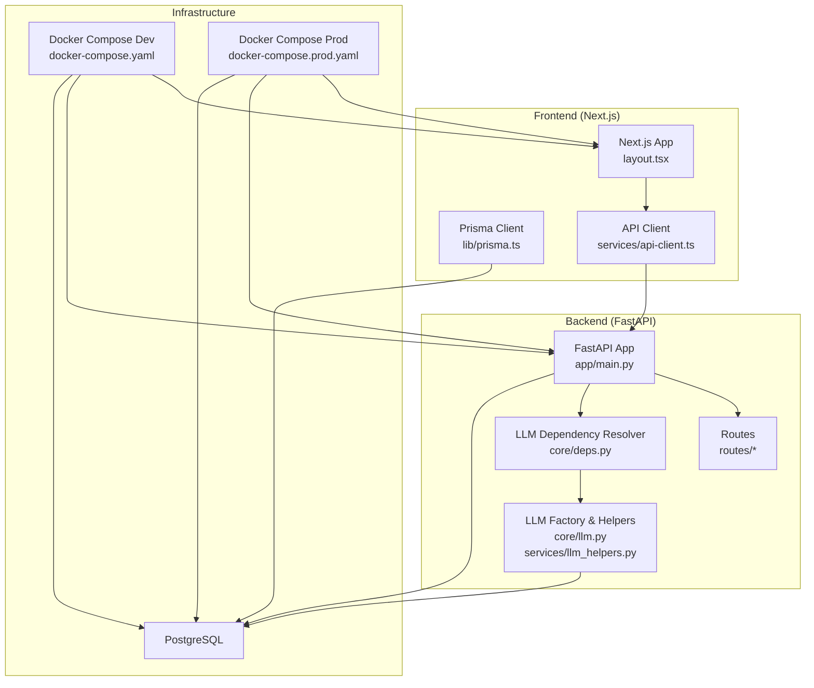
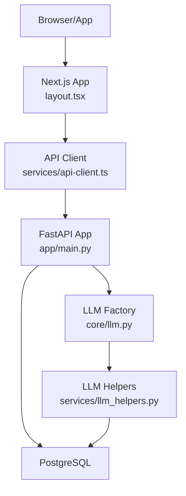
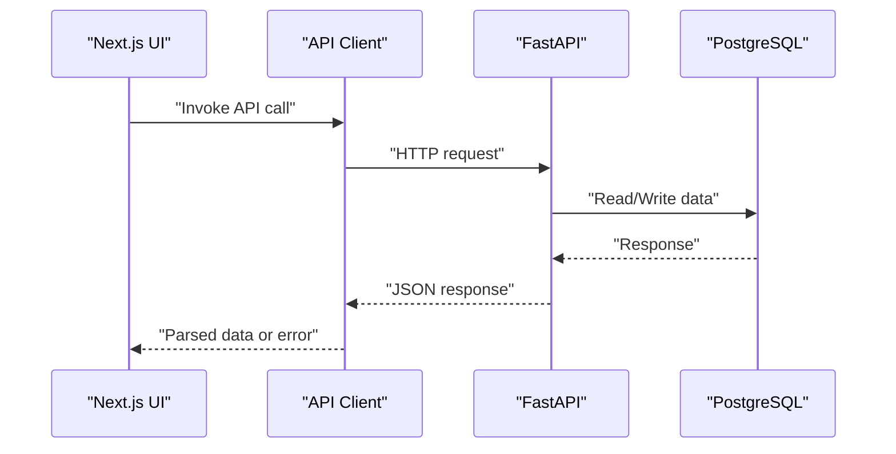
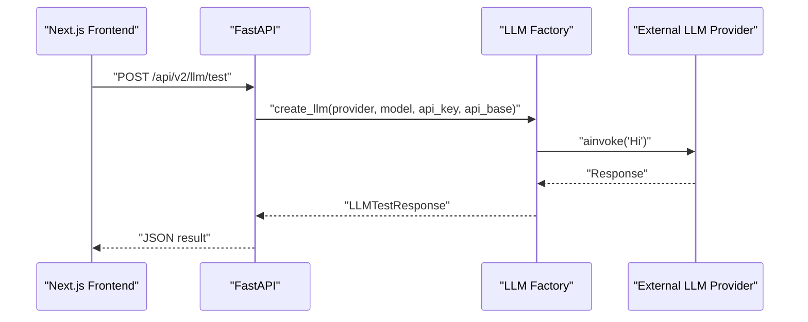
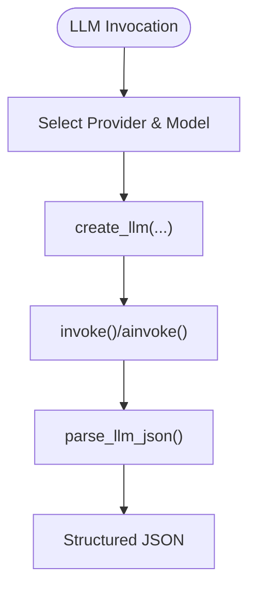
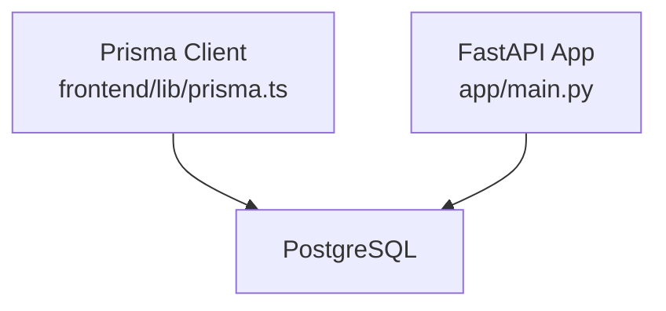
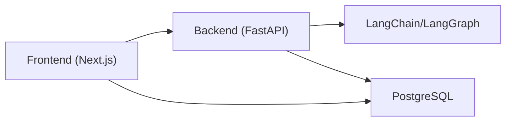

# Technical Architecture Overview

<cite>
**Referenced Files in This Document**
- [docker-compose.yaml](file://docker-compose.yaml)
- [docker-compose.prod.yaml](file://docker-compose.prod.yaml)
- [backend/Dockerfile](file://backend/Dockerfile)
- [frontend/Dockerfile](file://frontend/Dockerfile)
- [backend/pyproject.toml](file://backend/pyproject.toml)
- [frontend/package.json](file://frontend/package.json)
- [backend/app/main.py](file://backend/app/main.py)
- [backend/app/core/llm.py](file://backend/app/core/llm.py)
- [backend/app/routes/llm.py](file://backend/app/routes/llm.py)
- [backend/app/core/settings.py](file://backend/app/core/settings.py)
- [backend/app/core/deps.py](file://backend/app/core/deps.py)
- [backend/app/services/llm_helpers.py](file://backend/app/services/llm_helpers.py)
- [frontend/app/layout.tsx](file://frontend/app/layout.tsx)
- [frontend/lib/prisma.ts](file://frontend/lib/prisma.ts)
- [frontend/services/api-client.ts](file://frontend/services/api-client.ts)
</cite>

## Table of Contents
1. [Introduction](#introduction)
2. [Project Structure](#project-structure)
3. [Core Components](#core-components)
4. [Architecture Overview](#architecture-overview)
5. [Detailed Component Analysis](#detailed-component-analysis)
6. [Dependency Analysis](#dependency-analysis)
7. [Performance Considerations](#performance-considerations)
8. [Troubleshooting Guide](#troubleshooting-guide)
9. [Conclusion](#conclusion)

## Introduction
This document presents the technical architecture overview for TalentSync-Normies, a microservices-based platform integrating a Next.js frontend, a FastAPI backend, an AI/ML orchestration layer powered by LangChain, a PostgreSQL database, and containerized deployment via Docker. The system emphasizes modular, independently scalable components with clear separation of concerns across frontend UI, backend APIs, AI/ML processing, and persistent storage. It also documents cross-cutting concerns such as security, observability, and performance optimization, along with deployment topologies suitable for development and production environments.

## Project Structure
The repository is organized into four primary areas:
- Frontend: Next.js application with TypeScript, React components, client-side services, and Prisma ORM integration.
- Backend: FastAPI application written in Python, exposing REST endpoints and orchestrating AI/ML workflows.
- AI/ML Orchestration: LangChain-based LLM factory and helpers enabling multi-provider LLM support and JSON parsing utilities.
- Infrastructure: Docker Compose configurations for local development and production-grade deployments.

**Diagram sources**
- [docker-compose.yaml](file://docker-compose.yaml#L1-L78)
- [docker-compose.prod.yaml](file://docker-compose.prod.yaml#L1-L105)
- [backend/app/main.py](file://backend/app/main.py#L1-L203)
- [backend/app/core/llm.py](file://backend/app/core/llm.py#L1-L181)
- [backend/app/services/llm_helpers.py](file://backend/app/services/llm_helpers.py#L1-L94)
- [frontend/app/layout.tsx](file://frontend/app/layout.tsx#L1-L52)
- [frontend/lib/prisma.ts](file://frontend/lib/prisma.ts#L1-L10)
- [frontend/services/api-client.ts](file://frontend/services/api-client.ts#L1-L125)

**Section sources**
- [docker-compose.yaml](file://docker-compose.yaml#L1-L78)
- [docker-compose.prod.yaml](file://docker-compose.prod.yaml#L1-L105)
- [backend/Dockerfile](file://backend/Dockerfile#L1-L33)
- [frontend/Dockerfile](file://frontend/Dockerfile#L1-L110)

## Core Components
- Next.js Frontend
  - Provides the user interface, client-side services, and Prisma integration for database operations.
  - Uses a centralized API client for backend communication and a shared Prisma client instance.
- FastAPI Backend
  - Exposes REST endpoints under API versions v1 and v2, with middleware for request/response logging and CORS.
  - Orchestrates AI/ML workflows through LangChain and manages LLM configuration and testing.
- AI/ML Orchestration
  - LangChain-based LLM factory supports multiple providers (Google, OpenAI, Anthropic, Ollama, OpenRouter, DeepSeek).
  - Includes helpers for JSON parsing from LLM responses and synchronous/asynchronous completion utilities.
- PostgreSQL Database
  - Persistent relational store accessed by both frontend (Prisma) and backend (direct connection via environment).
  - Managed via Docker volumes and health-checked in production compose.

**Section sources**
- [frontend/app/layout.tsx](file://frontend/app/layout.tsx#L1-L52)
- [frontend/lib/prisma.ts](file://frontend/lib/prisma.ts#L1-L10)
- [frontend/services/api-client.ts](file://frontend/services/api-client.ts#L1-L125)
- [backend/app/main.py](file://backend/app/main.py#L1-L203)
- [backend/app/core/llm.py](file://backend/app/core/llm.py#L1-L181)
- [backend/app/services/llm_helpers.py](file://backend/app/services/llm_helpers.py#L1-L94)
- [backend/app/core/settings.py](file://backend/app/core/settings.py#L1-L50)

## Architecture Overview
The system follows a microservices design with clear boundaries:
- Frontend (Next.js) communicates with the Backend (FastAPI) over HTTP.
- Backend integrates with PostgreSQL for persistence and with external AI/ML providers via LangChain.
- Docker Compose orchestrates services locally and defines production-grade stages for migration and runtime.

**Diagram sources**
- [frontend/app/layout.tsx](file://frontend/app/layout.tsx#L1-L52)
- [frontend/services/api-client.ts](file://frontend/services/api-client.ts#L1-L125)
- [backend/app/main.py](file://backend/app/main.py#L1-L203)
- [backend/app/core/llm.py](file://backend/app/core/llm.py#L1-L181)
- [backend/app/services/llm_helpers.py](file://backend/app/services/llm_helpers.py#L1-L94)

## Detailed Component Analysis

### Frontend (Next.js) Component Analysis
- Application bootstrap and theme providers are defined in the root layout.
- Prisma client is initialized globally to avoid multiple instances during development and production.
- API client encapsulates HTTP requests, error handling, and JSON parsing for backend responses.

**Diagram sources**
- [frontend/app/layout.tsx](file://frontend/app/layout.tsx#L1-L52)
- [frontend/services/api-client.ts](file://frontend/services/api-client.ts#L1-L125)
- [backend/app/main.py](file://backend/app/main.py#L1-L203)

**Section sources**
- [frontend/app/layout.tsx](file://frontend/app/layout.tsx#L1-L52)
- [frontend/lib/prisma.ts](file://frontend/lib/prisma.ts#L1-L10)
- [frontend/services/api-client.ts](file://frontend/services/api-client.ts#L1-L125)

### Backend (FastAPI) Component Analysis
- Central FastAPI application registers middleware for request ID propagation and request/response logging.
- CORS is configured via settings, and routes are grouped by feature and version (v1/v2).
- LLM configuration and testing endpoints enable dynamic provider selection and validation.

**Diagram sources**
- [backend/app/main.py](file://backend/app/main.py#L1-L203)
- [backend/app/routes/llm.py](file://backend/app/routes/llm.py#L1-L50)
- [backend/app/core/llm.py](file://backend/app/core/llm.py#L1-L181)

**Section sources**
- [backend/app/main.py](file://backend/app/main.py#L1-L203)
- [backend/app/routes/llm.py](file://backend/app/routes/llm.py#L1-L50)
- [backend/app/core/settings.py](file://backend/app/core/settings.py#L1-L50)

### AI/ML Orchestration Component Analysis
- LLM factory supports multiple providers and temperature handling, with fallbacks and defaults.
- JSON parsing helpers normalize LLM outputs and extract structured data for downstream services.
- Dependency resolver selects either per-request LLM configuration or server defaults.

**Diagram sources**
- [backend/app/core/llm.py](file://backend/app/core/llm.py#L1-L181)
- [backend/app/services/llm_helpers.py](file://backend/app/services/llm_helpers.py#L1-L94)
- [backend/app/core/deps.py](file://backend/app/core/deps.py#L39-L68)

**Section sources**
- [backend/app/core/llm.py](file://backend/app/core/llm.py#L1-L181)
- [backend/app/services/llm_helpers.py](file://backend/app/services/llm_helpers.py#L1-L94)
- [backend/app/core/deps.py](file://backend/app/core/deps.py#L39-L68)

### Database Layer Component Analysis
- PostgreSQL is orchestrated via Docker Compose with named volumes for persistence.
- Production compose adds health checks and explicit network segmentation.
- Frontend uses Prisma client for type-safe database operations; backend connects directly via environment-derived URLs.

**Diagram sources**
- [frontend/lib/prisma.ts](file://frontend/lib/prisma.ts#L1-L10)
- [backend/app/main.py](file://backend/app/main.py#L1-L203)
- [docker-compose.yaml](file://docker-compose.yaml#L1-L78)
- [docker-compose.prod.yaml](file://docker-compose.prod.yaml#L1-L105)

**Section sources**
- [frontend/lib/prisma.ts](file://frontend/lib/prisma.ts#L1-L10)
- [docker-compose.yaml](file://docker-compose.yaml#L1-L78)
- [docker-compose.prod.yaml](file://docker-compose.prod.yaml#L1-L105)

## Dependency Analysis
- Technology Stack Choices
  - Frontend: Next.js with React, TypeScript, Prisma, and Radix UI components.
  - Backend: FastAPI with Python, LangChain, and LangGraph for agent/graph workflows.
  - Database: PostgreSQL managed via Docker volumes.
  - Containerization: Docker with multi-stage builds for efficient production images.
- Inter-Component Dependencies
  - Frontend depends on backend REST endpoints and Prisma for data access.
  - Backend depends on LangChain/LangGraph for AI/ML orchestration and PostgreSQL for persistence.
  - Both frontend and backend depend on environment variables for configuration.

**Diagram sources**
- [frontend/package.json](file://frontend/package.json#L1-L114)
- [backend/pyproject.toml](file://backend/pyproject.toml#L1-L42)
- [backend/app/main.py](file://backend/app/main.py#L1-L203)
- [backend/app/core/llm.py](file://backend/app/core/llm.py#L1-L181)

**Section sources**
- [frontend/package.json](file://frontend/package.json#L1-L114)
- [backend/pyproject.toml](file://backend/pyproject.toml#L1-L42)
- [backend/app/main.py](file://backend/app/main.py#L1-L203)

## Performance Considerations
- Container Images
  - Backend Dockerfile uses a slim Python base and caches dependencies via uv for faster builds.
  - Frontend Dockerfile employs multi-stage builds to minimize runtime footprint and improve startup times.
- AI/ML Responsiveness
  - Separate faster LLM model configuration allows lightweight operations while heavier tasks use the primary model.
  - JSON parsing helpers reduce retries and improve throughput for structured outputs.
- Observability
  - Request/response logging middleware records timing and payload sizes for performance insights.
- Scalability
  - Microservices enable independent scaling of frontend and backend tiers.
  - PostgreSQL can be scaled separately; consider read replicas or connection pooling for high concurrency.

[No sources needed since this section provides general guidance]

## Troubleshooting Guide
- Environment Variables
  - Ensure database and LLM provider keys are present in environment files consumed by Docker Compose.
- Health Checks
  - Production compose includes a database health check; verify readiness before starting dependent services.
- LLM Connectivity
  - Use the LLM test endpoint to validate provider configuration and connectivity.
- Logging
  - Review request/response logs emitted by the backend middleware for debugging payload issues.

**Section sources**
- [docker-compose.prod.yaml](file://docker-compose.prod.yaml#L15-L23)
- [backend/app/routes/llm.py](file://backend/app/routes/llm.py#L1-L50)
- [backend/app/main.py](file://backend/app/main.py#L82-L131)

## Conclusion
TalentSync-Normies adopts a clean microservices architecture with a Next.js frontend, FastAPI backend, LangChain-powered AI/ML orchestration, and PostgreSQL persistence, all containerized for reliable development and production deployments. The design supports independent scaling, robust provider flexibility, and strong operational visibility. By leveraging Docker Compose and multi-stage builds, the platform balances developer productivity with efficient resource utilization and maintainable CI/CD pipelines.