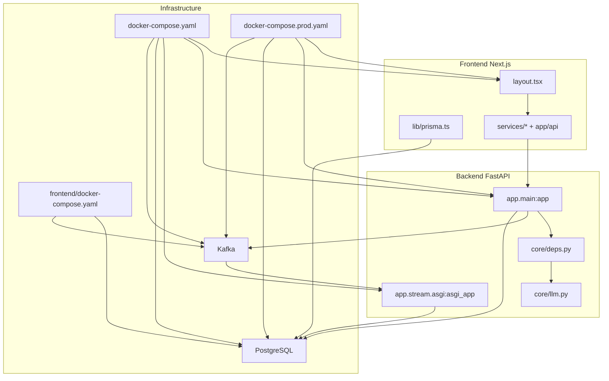
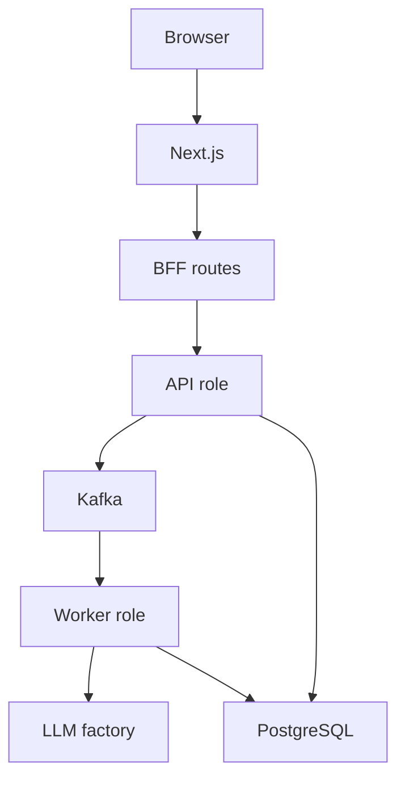
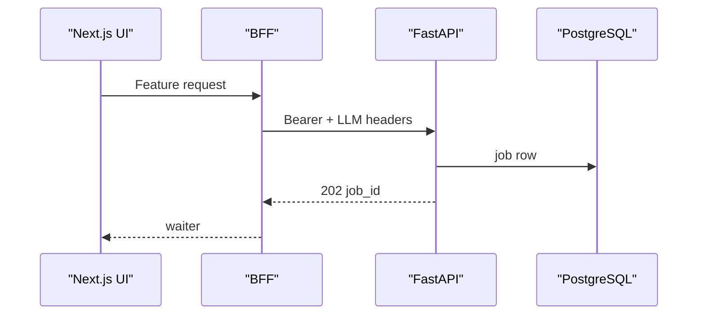
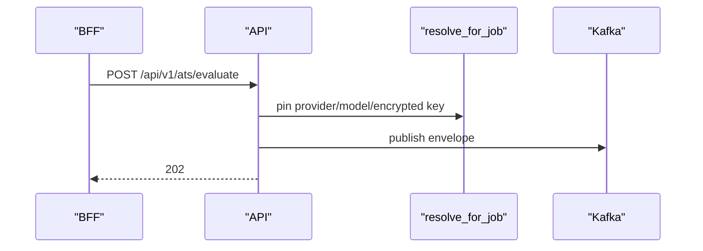
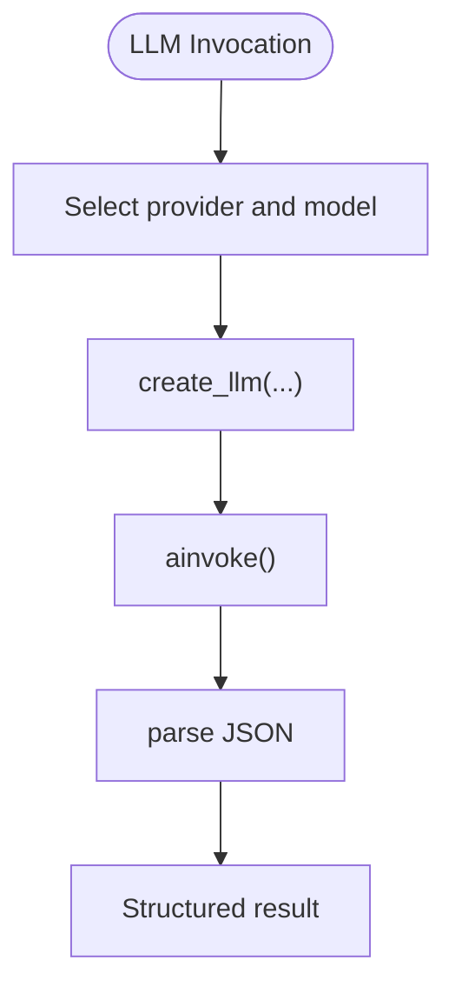
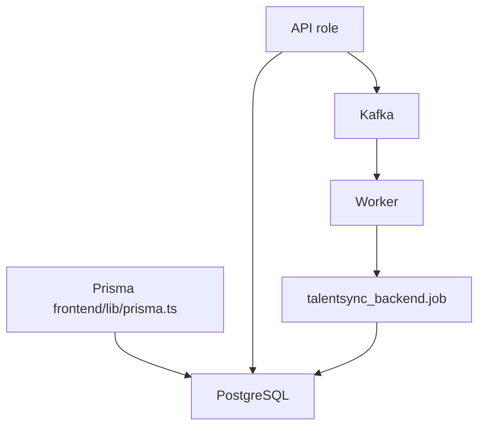

# Technical architecture overview

Next.js BFF, FastAPI API role, FastStream workers, Kafka, PostgreSQL. Python >=3.13. Bun on the frontend.

## Repository layout

- Frontend: Next.js, TypeScript, Prisma client, BFF under `frontend/app/api`
- Backend: FastAPI, LangChain/LangGraph, FastStream (`backend/app/stream/`)
- Infra: `docker-compose.yaml`, `docker-compose.prod.yaml`, `frontend/docker-compose.yaml`, `infra/`

```mermaid
graph TB
subgraph "Frontend Next.js"
FE_APP["layout.tsx"]
FE_PRISMA["lib/prisma.ts"]
FE_API["services/* + app/api"]
end
subgraph "Backend FastAPI"
BE_MAIN["app.main:app"]
BE_STREAM["app.stream.asgi:asgi_app"]
BE_LLM["core/llm.py"]
BE_DEPS["core/deps.py"]
end
subgraph "Infrastructure"
DOCKER_DEV["docker-compose.yaml"]
DOCKER_HOST["frontend/docker-compose.yaml"]
DOCKER_PROD["docker-compose.prod.yaml"]
DB["PostgreSQL"]
K["Kafka"]
end
FE_APP --> FE_API
FE_API --> BE_MAIN
BE_MAIN --> BE_DEPS
BE_DEPS --> BE_LLM
BE_MAIN --> K
K --> BE_STREAM
FE_PRISMA --> DB
BE_MAIN --> DB
BE_STREAM --> DB
DOCKER_DEV --> FE_APP
DOCKER_DEV --> BE_MAIN
DOCKER_DEV --> BE_STREAM
DOCKER_DEV --> DB
DOCKER_DEV --> K
DOCKER_HOST --> DB
DOCKER_HOST --> K
DOCKER_PROD --> FE_APP
DOCKER_PROD --> BE_MAIN
DOCKER_PROD --> DB
DOCKER_PROD --> K
```

## Building blocks

- Next.js: UI, Razorpay, session hydration. Rewrites `/api/v1/:path*` to the backend so cookies stay first-party.
- FastAPI `APP_ROLE=api`: validate, meter, enqueue, job read, SSE, token streams.
- FastAPI `APP_ROLE=worker`: consume lanes, run services, write job results.
- FastAPI `APP_ROLE=migrate`: `alembic upgrade head`.
- LLM factory: Google, OpenAI, Anthropic, Ollama, plus catalog from models.dev.
- Two model roles: primary (`LLM_*`) and small (`SMALL_LLM_*`). Do not mix keys across user and server configs.
- PostgreSQL: Prisma `public`, Alembic `talentsync_backend`.

## How it fits together

```mermaid
graph TB
Client["Browser"]
NextApp["Next.js"]
BFF["BFF routes"]
FastAPI["API role"]
Worker["Worker role"]
LLMFactory["LLM factory"]
DB["PostgreSQL"]
K["Kafka"]
Client --> NextApp
NextApp --> BFF
BFF --> FastAPI
FastAPI --> K
K --> Worker
Worker --> LLMFactory
FastAPI --> DB
Worker --> DB
```

## Frontend

Root layout sets providers (session replacement for NextAuth, React Query, theme). `getSession()` in `lib/session.ts` verifies the access JWT with `BACKEND_JWT_SECRET`. Client `useSession()` hits `/api/v1/auth/me`.

```mermaid
sequenceDiagram
participant UI as "Next.js UI"
participant BFF as "BFF"
participant Backend as "FastAPI"
participant DB as "PostgreSQL"
UI->>BFF : Feature request
BFF->>Backend : Bearer + LLM headers
Backend->>DB : job row
Backend-->>BFF : 202 job_id
BFF-->>UI : waiter
```

## Backend

Middleware: request id, access logs, CORS. Feature routers under `/api/v1`. `task_llm` resolves BYOK vs server defaults. `feature_gate` debits before enqueue.

```mermaid
sequenceDiagram
participant Client as "BFF"
participant Backend as "API"
participant LLM as "resolve_for_job"
participant K as "Kafka"
Client->>Backend : POST /api/v1/ats/evaluate
Backend->>LLM : pin provider/model/encrypted key
Backend->>K : publish envelope
Backend-->>Client : 202
```

## AI/ML orchestration

```mermaid
flowchart TD
Start(["LLM Invocation"]) --> CheckProvider["Select provider and model"]
CheckProvider --> CreateLLM["create_llm(...)"]
CreateLLM --> Invoke["ainvoke()"]
Invoke --> Parse["parse JSON"]
Parse --> Return["Structured result"]
```

Workers decrypt `job.llm_config` and call the same service functions the old sync routes used. No inline LLM path for metered features.

## Database and Kafka

```mermaid
graph TB
Prisma["Prisma frontend/lib/prisma.ts"]
DB["PostgreSQL"]
API["API role"]
W["Worker"]
K["Kafka"]
Jobs["talentsync_backend.job"]
Prisma --> DB
API --> DB
API --> K
K --> W
W --> Jobs
Jobs --> DB
```

Envelope is `job_id`, `job_type`, `user_id`, `attempt`. Payload stays in Postgres.

## Dependencies

- Frontend: Next.js, React 18.2, Prisma, TanStack Query, Razorpay. No `next-auth`.
- Backend: FastAPI, LangChain, LangGraph, Motor, PyMuPDF, FastStream >=0.7.3.
- Infra: Postgres 16, Kafka 3.9.1 KRaft, optional Prometheus/Grafana profile.

## Performance

uv-cached backend image. Multi-stage frontend image. Small model for titles. Kafka poll interval 30 minutes so enrichments do not get kicked out of the consumer group.

## Troubleshooting

- Missing `KAFKA_BOOTSTRAP_SERVERS`: workers never attach.
- Health: API `/docs`, worker `/health` on 8001.
- LLM test: `/api/v2/llm/test` still exists for provider checks.
- `NEXTAUTH_*` in `.env.example` is leftover naming. Google OAuth settings are the ones that matter.
