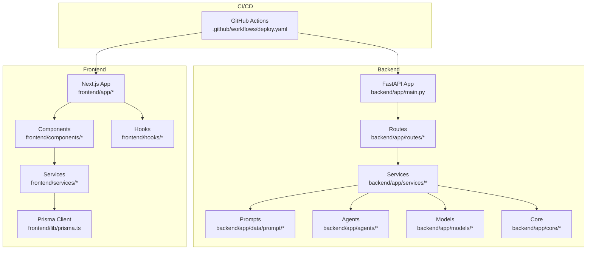
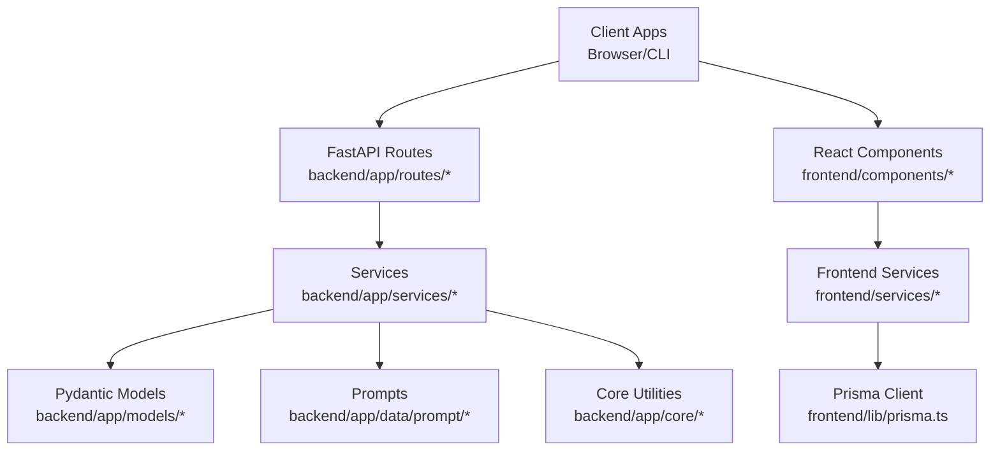
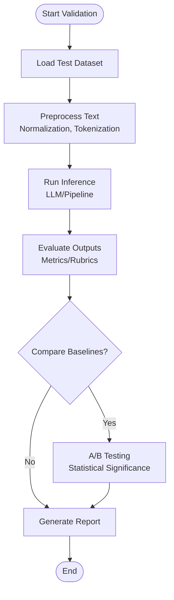
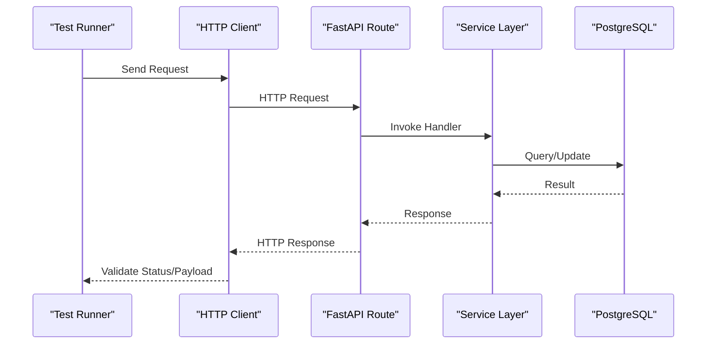
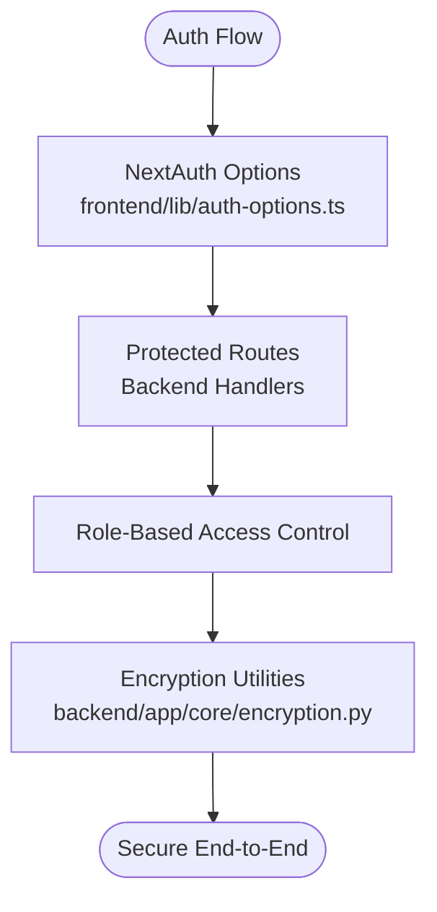
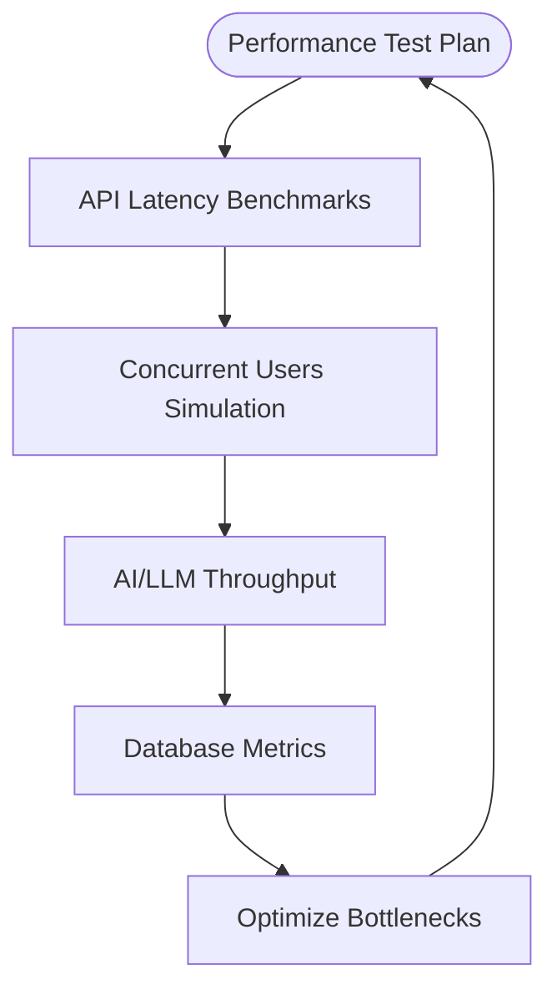
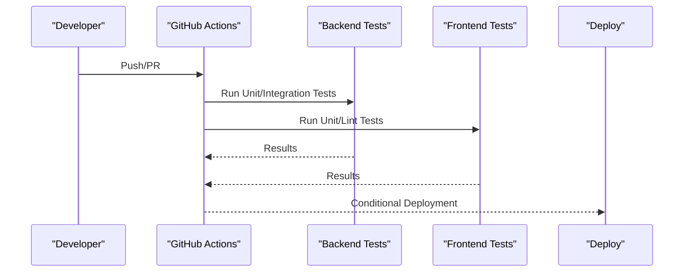
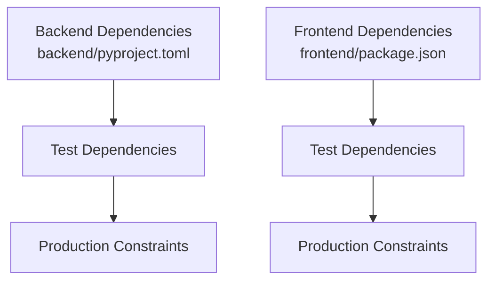

# Testing strategy

## Introduction
This page defines a detailed testing strategy for the TalentSync-Normies platform. It covers unit testing for backend FastAPI services and frontend React components, AI/ML model validation, integration testing for API endpoints and database operations, cross-service communication, NLP and LLM prompt effectiveness validation, performance testing for API response times and AI processing throughput, and security validation for authentication and authorization. It also outlines testing frameworks, test data management, continuous integration, and best practices for writing effective tests, mocking dependencies, and maintaining test coverage.

## Project structure
The platform comprises:
- Backend: FastAPI application with modular routes, services, models, prompts, agents, and core utilities.
- Frontend: Next.js application with React components, services, hooks, and Prisma ORM integration.
- CI/CD: GitHub Actions workflow for deployment.

```mermaid
graph TB
subgraph "Backend"
BMain["FastAPI App<br/>backend/app/main.py"]
BRoutes["Routes<br/>backend/app/routes/*"]
BSvc["Services<br/>backend/app/services/*"]
BPrompts["Prompts<br/>backend/app/data/prompt/*"]
BAgents["Agents<br/>backend/app/agents/*"]
BModels["Models<br/>backend/app/models/*"]
BCore["Core<br/>backend/app/core/*"]
end
subgraph "Frontend"
FApp["Next.js App<br/>frontend/app/*"]
FComponents["Components<br/>frontend/components/*"]
FServices["Services<br/>frontend/services/*"]
FHooks["Hooks<br/>frontend/hooks/*"]
FPrisma["Prisma Client<br/>frontend/lib/prisma.ts"]
end
subgraph "CI/CD"
GH["GitHub Actions<br/>.github/workflows/deploy.yaml"]
end
BMain --> BRoutes
BRoutes --> BSvc
BSvc --> BModels
BSvc --> BPrompts
BSvc --> BAgents
BSvc --> BCore
FApp --> FComponents
FComponents --> FServices
FServices --> FPrisma
FApp --> FHooks
GH --> BMain
GH --> FApp
```

## Core components
- Backend FastAPI application with modular routing and service layers.
- Frontend Next.js application with typed services and hooks for API interactions.
- Prisma ORM for database modeling and seeding.
- GitHub Actions for automated deployment.

Key testing areas:
- Unit tests for FastAPI services and route handlers.
- Unit tests for frontend components and services.
- Integration tests for API endpoints and database operations.
- AI/ML validation for NLP processing and prompt effectiveness.
- Security validation for authentication, authorization, and encryption.

## Architecture overview
The testing strategy aligns with the layered architecture:
- Backend routes depend on services; services depend on models, prompts, and core utilities.
- Frontend components depend on services; services depend on Prisma client.
- CI/CD deploys backend and frontend together.

```mermaid
graph TB
Client["Client Apps<br/>Browser/CLI"] --> Routes["FastAPI Routes<br/>backend/app/routes/*"]
Routes --> Services["Services<br/>backend/app/services/*"]
Services --> Models["Pydantic Models<br/>backend/app/models/*"]
Services --> Prompts["Prompts<br/>backend/app/data/prompt/*"]
Services --> Core["Core Utilities<br/>backend/app/core/*"]
Client --> FComponents["React Components<br/>frontend/components/*"]
FComponents --> FServices["Frontend Services<br/>frontend/services/*"]
FServices --> FPrisma["Prisma Client<br/>frontend/lib/prisma.ts"]
```

## Detailed component analysis

### Backend unit testing strategy
- Test framework: Use a Python testing framework suitable for FastAPI and asynchronous code. Given the project's focus on FastAPI and async operations, pytest with httpx for client testing is recommended.
- Mock external dependencies: Use unittest.mock or pytest-mock to mock LLM providers, database connections, and third-party agents.
- Route handler tests: Test each route handler with representative payloads, error conditions, and permission checks.
- Service layer tests: Validate business logic in services, including prompt composition, data processing, and model inference.
- Core utilities tests: Validate encryption, logging, and exception handling.

Recommended test discovery and structure:
- Place tests alongside source files under backend/tests or use a dedicated backend/tests directory.
- Use fixtures for common setup (e.g., database connections, LLM clients).

### Frontend unit testing strategy
- Test framework: Jest or Vitest with React Testing Library for component testing.
- Mock API calls: Use fetch/mocks or MSW to intercept service calls and return controlled responses.
- Component tests: Verify rendering, user interactions, and state transitions.
- Hook tests: Test custom hooks that encapsulate API logic and caching.
- Service tests: Validate service functions for composing requests and parsing responses.

Recommended test discovery and structure:
- Place tests alongside components under frontend/components/* and frontend/hooks/*.
- Use.test.* or.spec.* suffixes as indicated by frontend/.dockerignore.

### AI/ML model validation
- NLP processing: Validate text extraction, normalization, and feature engineering against known datasets.
- Prompt effectiveness: Evaluate LLM outputs for coherence, relevance, and completeness using rubrics and human evaluation.
- Model accuracy: Track metrics such as precision, recall, and F1-score for classification tasks; MAE/MSE for regression tasks.
- Cross-validation: Use k-fold cross-validation for reliable estimates.
- A/B testing: Compare prompt variants and model versions in controlled experiments.

```mermaid
flowchart TD
Start(["Start Validation"]) --> LoadData["Load Test Dataset"]
LoadData --> Preprocess["Preprocess Text<br/>Normalization, Tokenization"]
Preprocess --> Infer["Run Inference<br/>LLM/Pipeline"]
Infer --> Evaluate["Evaluate Outputs<br/>Metrics/Rubrics"]
Evaluate --> Compare{"Compare Baselines?"}
Compare --> |Yes| ABTest["A/B Testing<br/>Statistical Significance"]
Compare --> |No| Report["Generate Report"]
ABTest --> Report
Report --> End(["End"])
```

### Integration testing
- API endpoints: Use httpx or FastAPI TestClient to test routes with realistic payloads and error scenarios.
- Database operations: Use a test database instance (e.g., Postgres) managed by Docker Compose for isolation.
- Cross-service communication: Validate inter-service messaging and shared state consistency.

```mermaid
sequenceDiagram
participant Test as "Test Runner"
participant Client as "HTTP Client"
participant Route as "FastAPI Route"
participant Svc as "Service Layer"
participant DB as "PostgreSQL"
Test->>Client : Send Request
Client->>Route : HTTP Request
Route->>Svc : Invoke Handler
Svc->>DB : Query/Update
DB-->>Svc : Result
Svc-->>Route : Response
Route-->>Client : HTTP Response
Client-->>Test : Validate Status/Payload
```

### Security testing
- Authentication and authorization: Validate NextAuth flows, protected routes, and role-based access controls.
- Encryption: Verify sensitive data handling and encryption utilities.
- Input validation and sanitization: Ensure reliable validation and protection against injection attacks.
- LLM safety: Validate content filtering and prompt injection resistance.

```mermaid
flowchart TD
AuthStart(["Auth Flow"]) --> NextAuth["NextAuth Options<br/>frontend/lib/auth-options.ts"]
NextAuth --> ProtectedRoutes["Protected Routes<br/>Backend Handlers"]
ProtectedRoutes --> RBAC["Role-Based Access Control"]
RBAC --> Enc["Encryption Utilities<br/>backend/app/core/encryption.py"]
Enc --> AuthEnd(["Secure End-to-End"])
```

### Performance testing
- API response times: Benchmark endpoints under varying loads using tools like Locust or k6.
- Concurrent user handling: Simulate concurrent users and measure throughput and latency.
- AI processing throughput: Measure LLM inference latency and queue depths; optimize batching and concurrency.
- Database performance: Monitor query execution plans and connection pooling.

```mermaid
flowchart TD
PerfStart(["Performance Test Plan"]) --> API["API Latency Benchmarks"]
API --> Concurrency["Concurrent Users Simulation"]
Concurrency --> AI["AI/LLM Throughput"]
AI --> DB["Database Metrics"]
DB --> Optimize["Optimize Bottlenecks"]
Optimize --> PerfStart
```

[No sources needed since this diagram shows conceptual workflow, not actual code structure]

### Test data management
- Backend: Use fixtures and factories to generate synthetic data for tests. Seed a test database with deterministic data sets.
- Frontend: Use mock data and fixtures for components and services. Maintain a small set of representative datasets.
- AI/ML: Use curated datasets for training and validation; keep a separate test split.

### Continuous integration testing
- CI pipeline: Extend the existing GitHub Actions workflow to include unit, integration, and E2E tests.
- Backend tests: Run pytest suite against a test database container.
- Frontend tests: Run Jest/Vitest suite and lint checks.
- Linters and formatters: Enforce code quality standards.

```mermaid
sequenceDiagram
participant Dev as "Developer"
participant GH as "GitHub Actions"
participant Backend as "Backend Tests"
participant Frontend as "Frontend Tests"
participant Deploy as "Deploy"
Dev->>GH : Push/PR
GH->>Backend : Run Unit/Integration Tests
GH->>Frontend : Run Unit/Lint Tests
Backend-->>GH : Results
Frontend-->>GH : Results
GH-->>Deploy : Conditional Deployment
```

## Dependency analysis
- Backend dependencies include FastAPI, LangChain, Pydantic, cryptography, and others. Ensure test dependencies mirror production constraints.
- Frontend dependencies include Next.js, Prisma, Radix UI, and others. Use appropriate testing libraries aligned with these dependencies.

```mermaid
graph TB
BDep["Backend Dependencies<br/>backend/pyproject.toml"] --> BTest["Test Dependencies"]
FDep["Frontend Dependencies<br/>frontend/package.json"] --> FTest["Test Dependencies"]
BTest --> BProd["Production Constraints"]
FTest --> FProd["Production Constraints"]
```

## Performance considerations
- Asynchronous design: Ensure tests use async/await to avoid blocking and simulate real-world concurrency.
- Resource limits: Configure timeouts and resource limits for LLM calls and database queries.
- Caching: Integrate caching layers in tests to reduce repeated computation and improve speed.
- Profiling: Use profiling tools to identify slow paths in services and routes.

[No sources needed since this section provides general guidance]

## Troubleshooting guide
- Common errors: Validate error handling paths and ensure exceptions are surfaced appropriately.
- Logging: Enable structured logging during tests to capture context for failures.
- Mocking pitfalls: Avoid over-mocking; ensure mocks reflect realistic behavior.
- Database state: Reset test databases between runs to prevent cross-test contamination.

## Conclusion
A reliable testing strategy for TalentSync-Normies requires coordinated unit, integration, and performance testing across backend and frontend, with dedicated validation for AI/ML pipelines and strong security practices. By using the existing project structure and extending CI/CD with detailed test automation, the platform can maintain reliability, scalability, and trustworthiness.

[No sources needed since this section summarizes without analyzing specific files]

## Appendices

### Recommended testing tools and libraries
- Backend: pytest, httpx, pytest-asyncio, pytest-mock, coverage.py.
- Frontend: Jest/Vitest, React Testing Library, MSW, Playwright for E2E.
- AI/ML: scikit-learn metrics, pandas-profiling, pytest-benchmark.

### Example test coverage targets
- Backend: >80% line coverage for services and routes.
- Frontend: >85% line coverage for components and services.
- AI/ML: Detailed coverage for preprocessing, evaluation, and prompt logic.

[No sources needed since this section provides general guidance]
