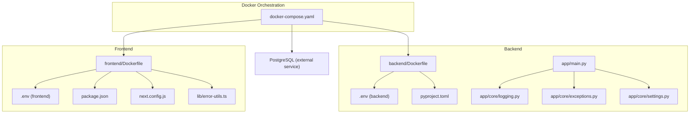
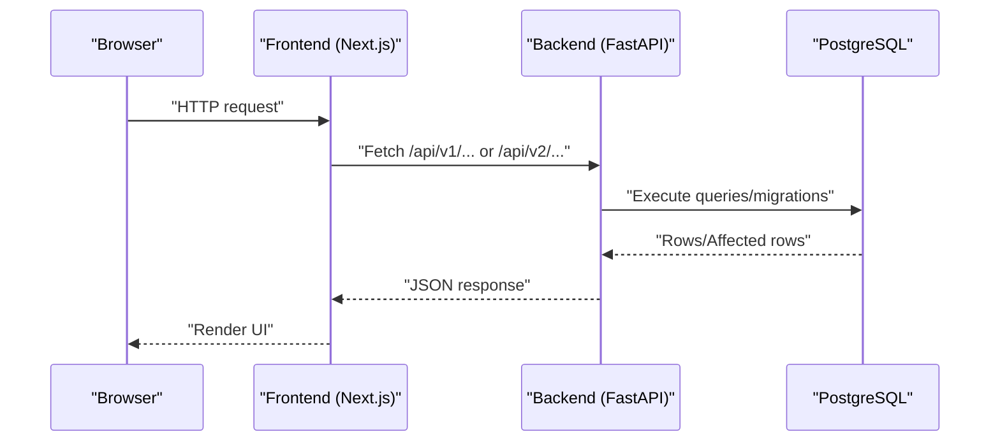
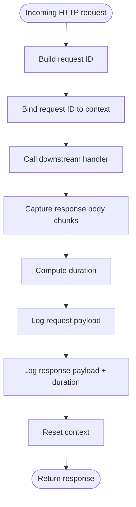
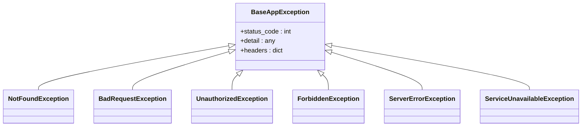
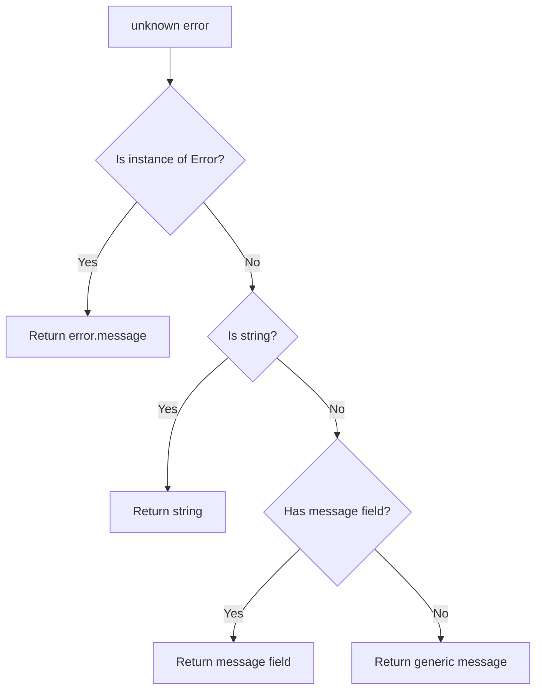
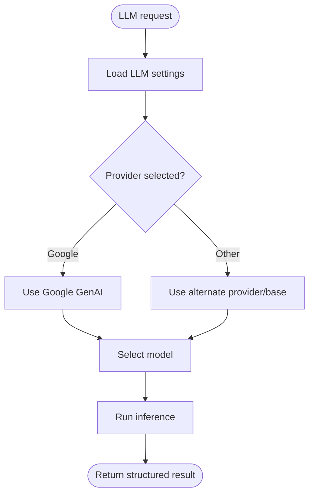
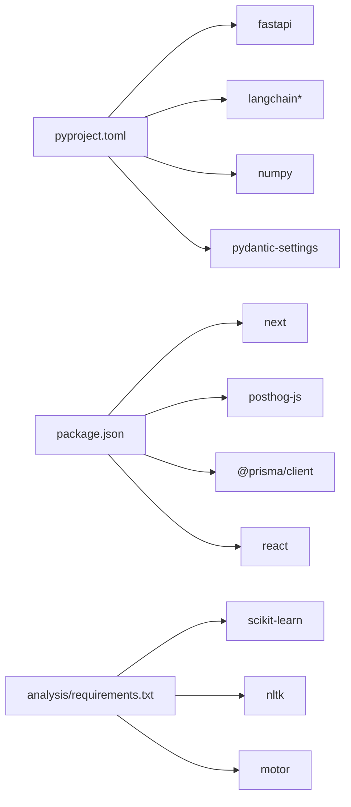

# Troubleshooting & FAQ

<cite>
**Referenced Files in This Document**
- [docker-compose.yaml](file://docker-compose.yaml)
- [backend/Dockerfile](file://backend/Dockerfile)
- [frontend/Dockerfile](file://frontend/Dockerfile)
- [backend/.env](file://backend/.env)
- [frontend/.env](file://frontend/.env)
- [backend/pyproject.toml](file://backend/pyproject.toml)
- [frontend/package.json](file://frontend/package.json)
- [backend/app/main.py](file://backend/app/main.py)
- [backend/app/core/logging.py](file://backend/app/core/logging.py)
- [backend/app/core/exceptions.py](file://backend/app/core/exceptions.py)
- [backend/app/core/settings.py](file://backend/app/core/settings.py)
- [frontend/next.config.js](file://frontend/next.config.js)
- [frontend/lib/error-utils.ts](file://frontend/lib/error-utils.ts)
- [analysis/requirements.txt](file://analysis/requirements.txt)
</cite>

## Update Summary
**Changes Made**
- Updated logging section to reflect the removal of verbose debug logging mode and enhanced logging levels
- Removed references to temporary logging enhancements that are no longer part of the codebase
- Updated troubleshooting guidance to match current logging capabilities
- Revised performance considerations to reflect simplified logging approach

## Table of Contents
1. [Introduction](#introduction)
2. [Project Structure](#project-structure)
3. [Core Components](#core-components)
4. [Architecture Overview](#architecture-overview)
5. [Detailed Component Analysis](#detailed-component-analysis)
6. [Dependency Analysis](#dependency-analysis)
7. [Performance Considerations](#performance-considerations)
8. [Troubleshooting Guide](#troubleshooting-guide)
9. [Conclusion](#conclusion)
10. [Appendices](#appendices)

## Introduction
This document provides comprehensive troubleshooting and Frequently Asked Questions for the TalentSync-Normies platform. It covers installation and environment setup issues, Docker configuration pitfalls, runtime errors and debugging techniques, performance tuning, AI/ML and NLP pipeline failures, and frontend-specific problems such as build errors, routing, and authentication. It also includes practical debugging tools and techniques for different environments, along with actionable answers to common questions about system requirements, feature limitations, and usage scenarios.

## Project Structure
The platform consists of:
- Backend: Python FastAPI application with AI/ML integrations, logging, and middleware.
- Frontend: Next.js application with PWA, PostHog instrumentation, and strict browser bundling rules.
- Database: PostgreSQL managed via Docker Compose.
- AI/ML assets: NLP model artifacts and pickled vectorizers packaged inside the backend container.

**Diagram sources**
- [docker-compose.yaml](file://docker-compose.yaml#L1-L78)
- [backend/Dockerfile](file://backend/Dockerfile#L1-L33)
- [frontend/Dockerfile](file://frontend/Dockerfile#L1-L110)
- [backend/.env](file://backend/.env#L1-L26)
- [frontend/.env](file://frontend/.env#L1-L27)
- [backend/pyproject.toml](file://backend/pyproject.toml#L1-L42)
- [frontend/package.json](file://frontend/package.json#L1-L114)
- [backend/app/main.py](file://backend/app/main.py#L1-L203)
- [backend/app/core/logging.py](file://backend/app/core/logging.py#L1-L117)
- [backend/app/core/exceptions.py](file://backend/app/core/exceptions.py#L1-L50)
- [backend/app/core/settings.py](file://backend/app/core/settings.py#L1-L50)
- [frontend/next.config.js](file://frontend/next.config.js#L1-L90)
- [frontend/lib/error-utils.ts](file://frontend/lib/error-utils.ts#L1-L17)

**Section sources**
- [docker-compose.yaml](file://docker-compose.yaml#L1-L78)
- [backend/Dockerfile](file://backend/Dockerfile#L1-L33)
- [frontend/Dockerfile](file://frontend/Dockerfile#L1-L110)
- [backend/.env](file://backend/.env#L1-L26)
- [frontend/.env](file://frontend/.env#L1-L27)
- [backend/pyproject.toml](file://backend/pyproject.toml#L1-L42)
- [frontend/package.json](file://frontend/package.json#L1-L114)
- [backend/app/main.py](file://backend/app/main.py#L1-L203)
- [backend/app/core/logging.py](file://backend/app/core/logging.py#L1-L117)
- [backend/app/core/exceptions.py](file://backend/app/core/exceptions.py#L1-L50)
- [backend/app/core/settings.py](file://backend/app/core/settings.py#L1-L50)
- [frontend/next.config.js](file://frontend/next.config.js#L1-L90)
- [frontend/lib/error-utils.ts](file://frontend/lib/error-utils.ts#L1-L17)

## Core Components
- Logging and request tracing: Structured logs with request IDs, access logs, and configurable log levels.
- Exception hierarchy: Centralized HTTP exception types for consistent error responses.
- Settings and configuration: Environment-driven configuration with caching and optional external keys.
- Middleware: CORS, request/response logging, and request ID propagation.
- Frontend error extraction: Utility to normalize thrown errors into user-friendly messages.

Key implementation references:
- Logging configuration and request ID propagation: [backend/app/core/logging.py](file://backend/app/core/logging.py#L1-L117)
- Exception types: [backend/app/core/exceptions.py](file://backend/app/core/exceptions.py#L1-L50)
- Settings and environment loading: [backend/app/core/settings.py](file://backend/app/core/settings.py#L1-L50)
- Request/response logging middleware: [backend/app/main.py](file://backend/app/main.py#L83-L132)
- Frontend error normalization: [frontend/lib/error-utils.ts](file://frontend/lib/error-utils.ts#L1-L17)

**Section sources**
- [backend/app/core/logging.py](file://backend/app/core/logging.py#L1-L117)
- [backend/app/core/exceptions.py](file://backend/app/core/exceptions.py#L1-L50)
- [backend/app/core/settings.py](file://backend/app/core/settings.py#L1-L50)
- [backend/app/main.py](file://backend/app/main.py#L83-L132)
- [frontend/lib/error-utils.ts](file://frontend/lib/error-utils.ts#L1-L17)

## Architecture Overview
High-level runtime flow:
- Frontend communicates with backend via internal Docker network.
- Backend exposes API routes grouped by feature areas.
- PostgreSQL stores application data; migrations are executed during frontend startup.
- AI/ML processing relies on configured LLM provider and model settings.

**Diagram sources**
- [docker-compose.yaml](file://docker-compose.yaml#L42-L68)
- [backend/app/main.py](file://backend/app/main.py#L157-L203)
- [frontend/Dockerfile](file://frontend/Dockerfile#L69-L79)

**Section sources**
- [docker-compose.yaml](file://docker-compose.yaml#L42-L68)
- [backend/app/main.py](file://backend/app/main.py#L157-L203)
- [frontend/Dockerfile](file://frontend/Dockerfile#L69-L79)

## Detailed Component Analysis

### Backend Logging and Tracing
- Request ID propagation via context variable ensures correlation across logs.
- Access logs capture client address, method, path, and status code.
- Log level respects settings and defaults to INFO for access logs.

**Diagram sources**
- [backend/app/main.py](file://backend/app/main.py#L71-L132)
- [backend/app/core/logging.py](file://backend/app/core/logging.py#L14-L26)

**Section sources**
- [backend/app/main.py](file://backend/app/main.py#L71-L132)
- [backend/app/core/logging.py](file://backend/app/core/logging.py#L14-L26)

### Exception Handling
- Centralized exception types for consistent HTTP responses.
- Useful for surfacing meaningful errors to clients and simplifying error handling logic.

**Diagram sources**
- [backend/app/core/exceptions.py](file://backend/app/core/exceptions.py#L6-L49)

**Section sources**
- [backend/app/core/exceptions.py](file://backend/app/core/exceptions.py#L1-L50)

### Frontend Error Extraction Utility
- Extracts a readable message from thrown values robustly handling Error instances, strings, and object-like structures.

**Diagram sources**
- [frontend/lib/error-utils.ts](file://frontend/lib/error-utils.ts#L4-L16)

**Section sources**
- [frontend/lib/error-utils.ts](file://frontend/lib/error-utils.ts#L1-L17)

### AI/ML and NLP Pipeline
- LLM configuration supports multiple providers and models via settings.
- NLTK data and pickled artifacts are bundled in the backend image.
- Interview-related timeouts and session limits are configurable.

**Diagram sources**
- [backend/app/core/settings.py](file://backend/app/core/settings.py#L21-L32)
- [backend/Dockerfile](file://backend/Dockerfile#L28-L28)

**Section sources**
- [backend/app/core/settings.py](file://backend/app/core/settings.py#L21-L32)
- [backend/Dockerfile](file://backend/Dockerfile#L28-L28)

## Dependency Analysis
- Backend Python dependencies are declared in pyproject.toml with pinned versions and optional sources.
- Frontend dependencies include Next.js, PostHog, Prisma client, and UI libraries.
- Analysis tools (Jupyter, scikit-learn, NLTK) are present in the analysis directory.

**Diagram sources**
- [backend/pyproject.toml](file://backend/pyproject.toml#L7-L33)
- [frontend/package.json](file://frontend/package.json#L17-L85)
- [analysis/requirements.txt](file://analysis/requirements.txt#L1-L69)

**Section sources**
- [backend/pyproject.toml](file://backend/pyproject.toml#L1-L42)
- [frontend/package.json](file://frontend/package.json#L1-L114)
- [analysis/requirements.txt](file://analysis/requirements.txt#L1-L69)

## Performance Considerations
- Logging overhead: Enable DEBUG selectively in development; production defaults reduce noise.
- Middleware latency: Request/response logging reads bodies; avoid enabling in high-throughput production without capacity planning.
- Interview code execution timeout: Tune based on compute resources and safety requirements.
- Frontend PWA and asset proxying: Ensure PostHog proxy rules are intact to avoid extra hops.

Practical tips:
- Set LOG_LEVEL to INFO in production and enable DEBUG only for targeted investigations.
- Monitor response durations captured in access logs for hotspots.
- Adjust interview timeouts and session max age per workload.
- Verify PostHog rewrites and static asset proxying in next.config.js.

**Section sources**
- [backend/app/core/logging.py](file://backend/app/core/logging.py#L28-L33)
- [backend/app/main.py](file://backend/app/main.py#L83-L132)
- [backend/app/core/settings.py](file://backend/app/core/settings.py#L40-L44)
- [frontend/next.config.js](file://frontend/next.config.js#L73-L86)

## Troubleshooting Guide

### Installation and Environment Setup

Common issues:
- Dependency conflicts between Python packages and system packages.
- Missing environment variables causing configuration failures.
- Incorrect Docker build args or stage assumptions.

Resolutions:
- Use the provided Dockerfiles and compose file to ensure consistent environments.
- Validate .env files for both backend and frontend; ensure DATABASE_URL and API keys are present.
- For Python dependencies, rely on uv-based installation in the backend Dockerfile.
- For Bun/Next.js, ensure lockfile integrity and production-only installs in the frontend Dockerfile.

**Section sources**
- [backend/Dockerfile](file://backend/Dockerfile#L14-L22)
- [frontend/Dockerfile](file://frontend/Dockerfile#L59-L63)
- [backend/.env](file://backend/.env#L1-L26)
- [frontend/.env](file://frontend/.env#L1-L27)

### Docker Configuration Errors

Symptoms:
- Containers fail to start or crash immediately.
- Port conflicts or networking issues between services.
- Frontend fails to migrate or seed on startup.

Checks:
- Confirm service dependencies and order: db then backend, then frontend.
- Ensure NEXTAUTH_URL and BACKEND_URL are correctly set for internal Docker networking.
- Verify volume mounts for uploads and NLTK data paths.
- Confirm port exposure for frontend (3000) and backend (8000).

**Section sources**
- [docker-compose.yaml](file://docker-compose.yaml#L3-L78)
- [frontend/Dockerfile](file://frontend/Dockerfile#L69-L79)
- [backend/Dockerfile](file://backend/Dockerfile#L28-L28)

### Runtime Errors: Debugging and Log Analysis

**Updated** Removed references to verbose debug logging mode and enhanced logging levels that were part of temporary logging enhancements.

Techniques:
- Correlate logs using X-Request-ID header returned by backend responses.
- Inspect access logs for client address, method, path, and status code.
- Use DEBUG mode temporarily to increase verbosity during investigations.

Tools:
- Request/response logging middleware captures payloads and durations.
- Centralized exception types help standardize error surfaces.

**Section sources**
- [backend/app/main.py](file://backend/app/main.py#L71-L132)
- [backend/app/core/logging.py](file://backend/app/core/logging.py#L56-L97)
- [backend/app/core/exceptions.py](file://backend/app/core/exceptions.py#L1-L50)

### Performance Issues

Slow API responses:
- Review access logs for long-duration requests.
- Check for blocking operations in routes or services.
- Validate LLM provider availability and rate limits.

Memory usage optimization:
- Reduce DEBUG logging in production.
- Limit concurrent interview sessions and code execution timeouts.
- Monitor container memory limits and scale accordingly.

Database query tuning:
- Ensure migrations run successfully on frontend startup.
- Use connection pooling and appropriate indexes as per Prisma schema.

**Section sources**
- [backend/app/main.py](file://backend/app/main.py#L83-L132)
- [backend/app/core/logging.py](file://backend/app/core/logging.py#L28-L33)
- [backend/app/core/settings.py](file://backend/app/core/settings.py#L40-L44)
- [frontend/Dockerfile](file://frontend/Dockerfile#L69-L79)

### AI/ML and NLP Pipeline Failures

Symptoms:
- LLM provider errors or invalid API keys.
- Missing or corrupted model artifacts.
- Interview code execution timeouts or sandbox issues.

Checks:
- Verify GOOGLE_API_KEY or alternate LLM API key/base are set.
- Confirm NLTK data path exists in the backend image.
- Adjust interview timeouts and session limits.

**Section sources**
- [backend/app/core/settings.py](file://backend/app/core/settings.py#L21-L32)
- [backend/Dockerfile](file://backend/Dockerfile#L9-L9)
- [backend/app/core/settings.py](file://backend/app/core/settings.py#L40-L44)

### Frontend-Specific Problems

Build errors:
- Production-only dependencies are installed in the final stage.
- Ensure prisma generate runs before build/start.
- Validate NEXT_PUBLIC_* variables passed as build args if used.

Routing issues:
- Verify rewrites for PostHog static assets and API endpoints.
- Ensure skipTrailingSlashRedirect is enabled for PostHog compatibility.

Authentication failures:
- Confirm NEXTAUTH_URL matches the external URL used by users.
- Validate NEXTAUTH_SECRET and provider credentials in .env.

**Section sources**
- [frontend/Dockerfile](file://frontend/Dockerfile#L45-L46)
- [frontend/Dockerfile](file://frontend/Dockerfile#L59-L63)
- [frontend/next.config.js](file://frontend/next.config.js#L73-L86)
- [frontend/.env](file://frontend/.env#L6-L6)

### Debugging Tools and Techniques

**Updated** Removed references to verbose debug logging mode and enhanced logging levels.

- Backend:
  - Enable DEBUG via settings for targeted investigations.
  - Use request ID propagation to trace end-to-end flows.
  - Inspect access logs for anomalies.

- Frontend:
  - Use error-utils to normalize thrown errors in UI.
  - Validate PostHog proxy rules and static asset delivery.
  - Confirm NEXT_PUBLIC variables are correctly injected.

**Section sources**
- [backend/app/core/logging.py](file://backend/app/core/logging.py#L100-L117)
- [backend/app/main.py](file://backend/app/main.py#L71-L80)
- [frontend/lib/error-utils.ts](file://frontend/lib/error-utils.ts#L1-L17)
- [frontend/next.config.js](file://frontend/next.config.js#L73-L86)

## Conclusion
By leveraging the built-in logging, exception handling, and environment-driven configuration, most issues in TalentSync-Normies can be diagnosed quickly. Use Docker Compose as the single source of truth for environment setup, and rely on request IDs and access logs for correlation. For AI/ML and NLP concerns, validate provider credentials and model artifacts. For frontend issues, focus on build stages, PostHog configuration, and authentication settings.

## Appendices

### Frequently Asked Questions

Q: What are the system requirements?
- Backend requires Python 3.13 and sufficient CPU/RAM for LLM inference and PDF processing.
- Frontend requires Node/Bun compatible with Next.js 16 and Prisma.
- PostgreSQL 16 is used in containers; ensure host has adequate disk space for volumes.

Q: Why does the frontend fail to start with migration errors?
- Migrations run via a one-shot container stage; ensure db is healthy and credentials are correct.
- Check that DATABASE_URL and NEXTAUTH_URL are set appropriately for the environment.

Q: How do I fix authentication issues?
- Ensure NEXTAUTH_URL matches the external URL.
- Verify NEXTAUTH_SECRET and provider credentials in .env.
- Confirm cookies and redirects are allowed by CORS settings.

Q: How can I improve slow API responses?
- Reduce DEBUG logging in production.
- Investigate long-duration requests via access logs.
- Tune interview timeouts and session limits.

Q: What should I check if LLM calls fail?
- Confirm GOOGLE_API_KEY or alternate LLM API key/base are set.
- Verify model name and provider configuration.
- Check network connectivity and rate limits.

Q: How do I handle NLTK/NLP model errors?
- Ensure NLTK data path is mounted and initialized in the backend image.
- Rebuild backend image if artifacts are missing.

Q: Why are PostHog events not recorded?
- Verify PostHog rewrites and static asset proxy rules.
- Confirm NEXT_PUBLIC_POSTHOG_* variables are set.

**Section sources**
- [backend/app/core/settings.py](file://backend/app/core/settings.py#L15-L32)
- [frontend/next.config.js](file://frontend/next.config.js#L73-L86)
- [backend/Dockerfile](file://backend/Dockerfile#L9-L9)
- [docker-compose.yaml](file://docker-compose.yaml#L55-L62)