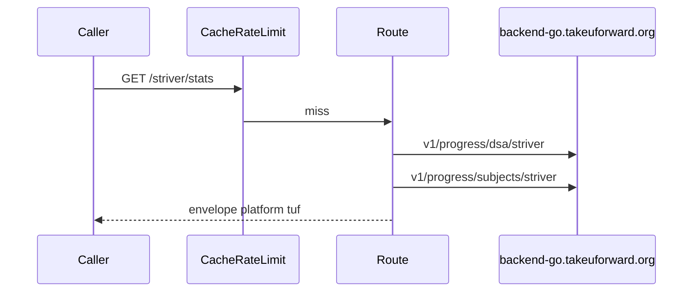

# Envelope and schemas

`PLATFORM = "tuf"`, `CATEGORY = "dsa"`. No `/topics` extra route. Topics live inside `/stats`.

Try it: [playground](https://tuf-stats.tashif.codes/playground), [OpenAPI](https://tuf-stats.tashif.codes/docs), sample [striver](https://tuf-stats.tashif.codes/striver/profile).

## Input

No body, no auth. Path `username`. Heatmap `view` / `year`. SVG `theme` / `exclude`.

```http
GET /striver/stats HTTP/1.1
Host: tuf-stats.tashif.codes

GET /striver/heatmap?view=year&year=2026 HTTP/1.1
Host: tuf-stats.tashif.codes
```

Server-side Go backend. Browser-like Origin/Referer. Timeout `TUF_REQUEST_TIMEOUT` default 20. Base `TUF_BACKEND_URL` default `https://backend-go.takeuforward.org/api`.

```http
GET v1/shared/profile/get-profile/{username} HTTP/1.1
GET v1/progress/dsa/{username} HTTP/1.1
GET v1/progress/subjects/{username} HTTP/1.1
GET v1/streak/heatmap/{username}?year= HTTP/1.1
```

`success: false` from upstream is HTTP 502. Older shared-profile URL 404s. This API uses DSA progress. See [DSA progress API](5.1-dsa-progress-api).

## Output envelope

```json
{
  "status": "success",
  "message": "retrieved",
  "platform": "tuf",
  "username": "striver",
  "cached": false,
  "data": {}
}
```

## `data` by route

Profile: `personal_info.name` / `college`, `profile_image.image_url`, social github/twitter/x/linkedin/website.

Stats: `easy|medium|hard.solved`, `total_dsa` → `totalQuestions`. Topics from subjects (`subject_name`, `progress_count` or `solved_problem_ids` length).

Contests / rating / badges routes still `await fetch_dsa_progress(username)` so a missing user 404s, then return empty models so CodeTrace's six-way loop does not special-case the platform.

Heatmap years before 2023 are rejected upstream. `TUF_FIRST_HEATMAP_YEAR` default 2023. Mapper always walks that year through `max(today, requested)`. Nested shape is `data.months[month][day]` with `total` / `dsa_sheet_checked` / `problem_solved`.

SVG: `image/svg+xml`.

## Errors

Missing user: 404. Invalid-user marker adds `"username not found"` on top of the family list.

## Request / response cycle



[Request path](5.2-request-path). Redis also speaks Upstash REST. `TUF_REDIS_URL` wins over `REDIS_URL`.
