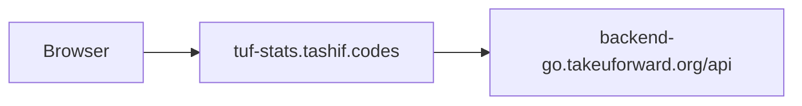

# Architecture

takeUforward DSA sheet reader. No contests, no rating, no `/topics` extra route. Topics live inside `/stats`. Contests/rating/badges routes still `await fetch_dsa_progress(username)` so a missing user 404s, then return empty models so CodeTrace's six-way loop does not special-case the platform.

App is `app:app`. No `__main__`. Local port 8007.

TUF is the sibling that also speaks Upstash REST (`UPSTASH_REDIS_REST_URL` + token) besides `REDIS_URL` / `TUF_REDIS_URL`. Invalid-user marker adds `"username not found"`. Full Redis walk is on [Request path](5.2-request-path).

Older shared-profile URL 404s. The frontend uses DSA progress. This API does the same.
