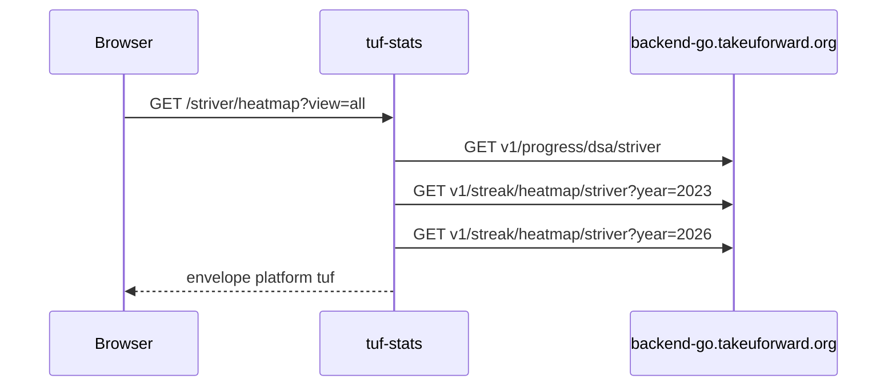

# DSA progress API

Not a scrape. The takeUforward frontend talks to `backend-go.takeuforward.org`. This service sends the same Origin/Referer a browser would. Older shared-profile URL 404s.

Playground: [tuf-stats.tashif.codes/playground](https://tuf-stats.tashif.codes/playground). Sample handle `striver`.

Base `TUF_BACKEND_URL` default `https://backend-go.takeuforward.org/api`. Browser-like Origin/Referer and `TUF_USER_AGENT`. Timeout `TUF_REQUEST_TIMEOUT` default 20.

```http
GET v1/shared/profile/get-profile/{username}
GET v1/progress/dsa/{username}
GET v1/progress/subjects/{username}
GET v1/streak/heatmap/{username}?year=
```

`success: false` from upstream is HTTP 502.

Heatmap years before 2023 are rejected upstream. `TUF_FIRST_HEATMAP_YEAR` default 2023. Mapper `_years_for_heatmap` always walks that year through `max(today, requested)`. Nested shape is `data.months[month][day]` with `total` / `dsa_sheet_checked` / `problem_solved`.

Topics come from subjects (`subject_name`, `progress_count` or `solved_problem_ids` length), not a `/topics` route.

Mapper: `personal_info.name/college`, `profile_image.image_url`, social github/twitter/x/linkedin/website. Stats `easy|medium|hard.solved`, `total_dsa` → `totalQuestions`. Empty Contests / Rating / Badges.

Playground sample handle is `striver`.

## End-to-end walk

Headers: `origin: https://takeuforward.org`, `referer: https://takeuforward.org/`, Firefox UA by default.



Timeout → 504. HTTP error from Go → that status with `message` / `error` / `detail`. `success: false` → 502. Non-object JSON → 502.

Contests, rating, badges still call `fetch_dsa_progress` first so a missing user 404s, then return empty models. Topics come from `v1/progress/subjects/{username}`, not a `/topics` route.
