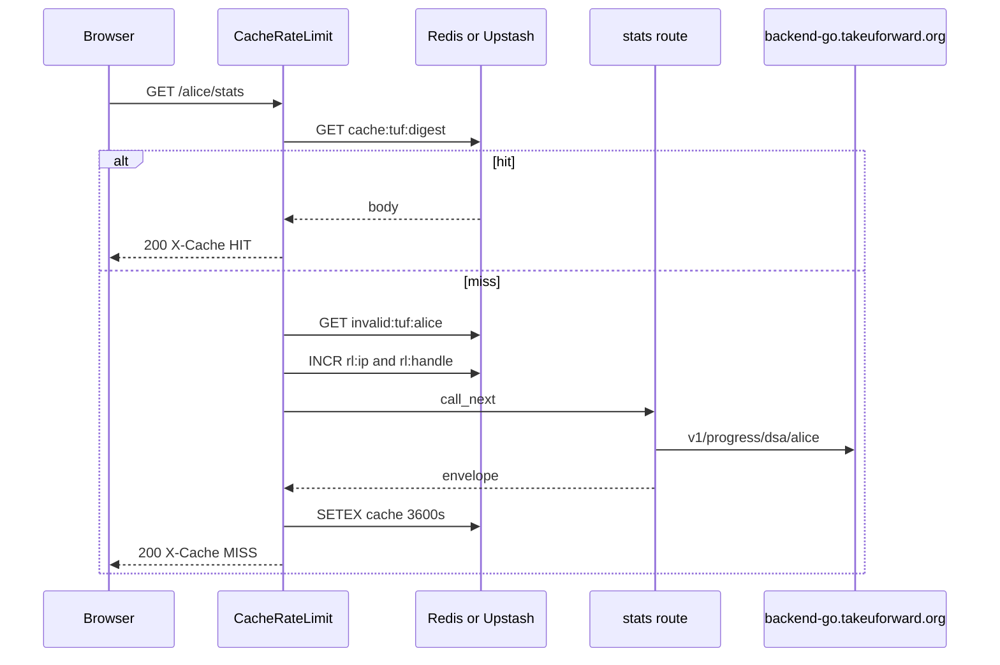

# Request path

Walk of `GET /alice/stats` with Redis on. `platform="tuf"`. TUF is the sibling that also speaks Upstash REST besides a wire URL.

1. CORS middleware (added first, runs second).
2. `CacheRateLimitMiddleware` with `platform="tuf"` (added last, runs first).
3. Skip check. Path is not `/`, `/docs`, `/redoc`, `/openapi.json`, `/favicon.ico`. Method is GET. Redis is on.
4. Handle is the first path segment, lowercased: `alice`.
5. Cache key is `cache:tuf:{sha256(GET:/alice/stats:sorted_query)}`.
6. On HIT, body is base64-decoded and returned with `X-Cache: HIT`. Done.
7. Negative key `invalid:tuf:alice`. On HIT, HTTP 404 `User does not exist`, `X-Cache: NEGATIVE-HIT`. Invalid-user rate limits apply (10/IP and 5/handle per 10 minutes).
8. Live limits: 60 req/min per IP, 30 req/min per handle. Over: 429 with `Retry-After` and exponential backoff 5s to 300s.
9. Route `fetch_dsa_progress`. Contests, rating, and badges still call that fetch so a missing user 404s, then return empty models.
10. `make_envelope` wraps it. HTTP 200 cached for 3600s unless `Cache-Control` says otherwise. `X-Cache: MISS`.

Without Redis, steps 5 to 8 disappear. Every GET hits `backend-go.takeuforward.org`. Rate limits disappear too.

`redis_enabled()` is true if `TUF_REDIS_URL` or `REDIS_URL` is set, or both `UPSTASH_REDIS_REST_URL` and `UPSTASH_REDIS_REST_TOKEN`. Integer knobs also accept a `TUF_` prefix (`TUF_API_CACHE_TTL_SECONDS` wins over `API_CACHE_TTL_SECONDS`).

Invalid-user markers add `"username not found"` on top of the family list. TUF's Go backend uses that wording.

IP is `X-Forwarded-For` first hop, else `X-Real-IP`, else `request.client.host`.

`/playground` is not in `SKIP_PATHS`. With Redis on, the first path segment is treated as handle `playground`. Playground sample handle is `striver`.

## Redis env

Wire URL or Upstash REST. Redis errors fail open: cache miss, rate limit allow.

| Env | Default |
| --- | --- |
| `TUF_REDIS_URL` or `REDIS_URL` | unset |
| `UPSTASH_REDIS_REST_URL` + `UPSTASH_REDIS_REST_TOKEN` | unset |
| `API_CACHE_TTL_SECONDS` (or `TUF_API_CACHE_TTL_SECONDS`) | 3600 |
| `INVALID_USER_CACHE_TTL_SECONDS` | 300 |
| `RATE_LIMIT_IP_REQUESTS` | 60 per 60s |
| `RATE_LIMIT_HANDLE_REQUESTS` | 30 per 60s |
| `INVALID_RATE_LIMIT_IP_REQUESTS` | 10 per 600s |
| `INVALID_RATE_LIMIT_HANDLE_REQUESTS` | 5 per 600s |
| `RATE_LIMIT_BACKOFF_BASE_SECONDS` | 5 |
| `RATE_LIMIT_BACKOFF_MAX_SECONDS` | 300 |

Keys:

- `cache:tuf:{sha256}`
- `invalid:tuf:{handle}`
- `rl:ip:tuf:{ip}` / `rl:handle:tuf:{handle}`
- `backoff:{same}` / `violations:{same}`
